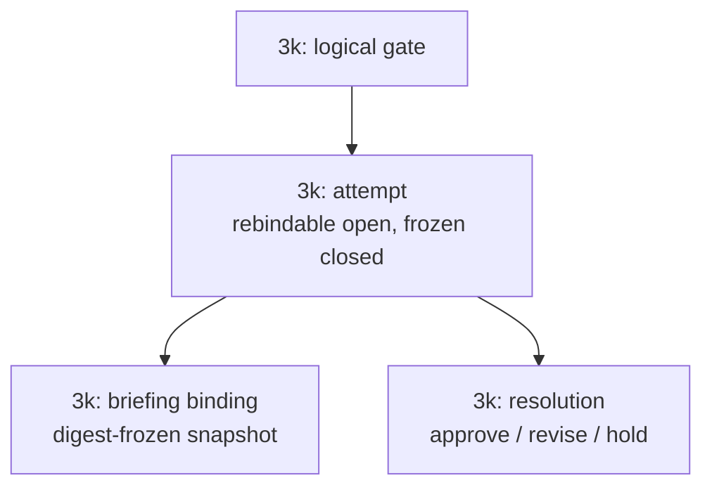
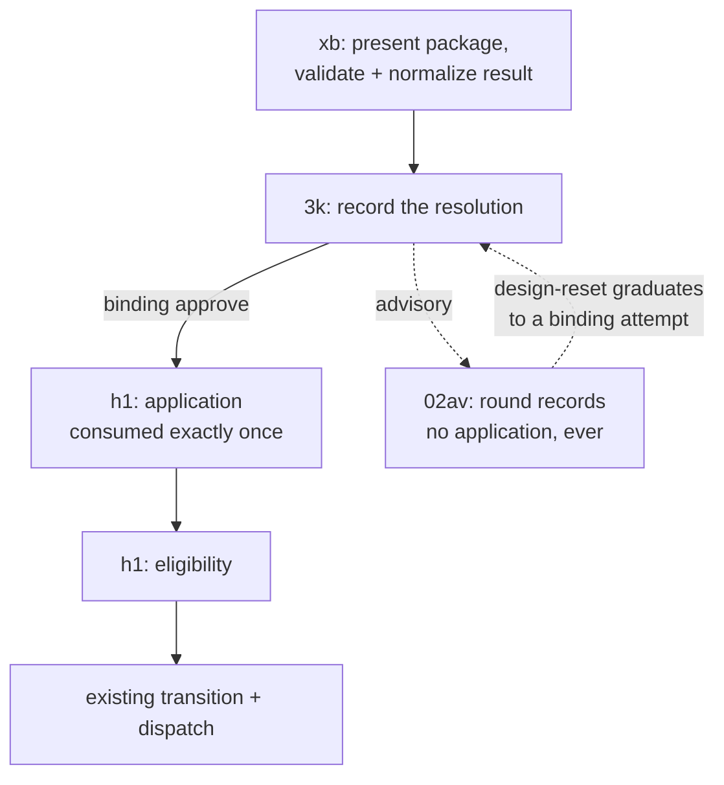

# Gate Resolution frontmatter contract

Status: proposed first implementation for the recorder
Date: 2026-07-19

*Section owner tags are shaping-time scaffolding naming the implementing tasks; they are removed when the spec lands — the landed document speaks only in component terms. This scaffolding includes the task-id prefixes in the diagram labels and the task-slug/task-id tokens in the CLI and YAML examples; the landing pass converts labels to component prefixes (re-checking render width) and genericizes example ids.*

## What the recorder ships first

**Owner:** 3k.

The recorder separates a captain's gate decision — the resolution (what the decision *is*)
— from the workflow action that follows it — the application (what the decision *does*),
owned by the application layer per the captain's 2026-07-21 resolution-first split.
The recorder's first implementation ships:

1. A gate attempt and its current immutable Briefing are directly readable from the
   entity's `gates` frontmatter.
2. The exact authenticated Resolution can close that attempt without changing
   `status`, routing feedback, or dispatching a worker.
3. Status can show the recorded resolution states — a recorded `approve`, `hold`, or
   `revise` — after restart. (The approved-pending/approved-held/stale/consumed
   application-eligibility surfacing is owned by the application layer.)
4. **(The application layer.)** Once the guards pass, the First Officer applies
   the recorded action once through the existing workflow transition and dispatch path.
   The gate record does not create a second dispatch protocol.

The ownership shape, in two small stacked views. First, the record the recorder owns — one logical
gate holds attempts, and each attempt binds one briefing and one resolution:



Second, the flow across owners — the presentation command obtains the decision, the
recorder records the resolution, the application layer applies it once eligible, and round
records stay advisory:



The design-reset edge is drawn to the resolution to keep one column; semantically it opens
a NEW binding attempt on the gate.

The first use begins when the First Officer needs captain input before recommending a
gate:

> This design would benefit from your input before I can recommend it at the gate.
> Normally I would relay your comments to the ensign. Would you like to try Subspace
> so the ensign can show you the complete design, receive your annotations directly,
> and revise it before I bring it back for approval? [Y/n]

On yes, the First Officer uses `followup_task` on the still-addressable gate-attempt
ensign. That same ensign checks for `subspace-tui` and the Subspace review skill.
Missing pieces produce the exact relevant action:

```sh
brew install spacedock-dev/tap/subspace-beta

claude plugin marketplace add spacedock-dev/marketplace
claude plugin install subspace@spacedock

codex plugin marketplace add spacedock-dev/marketplace
codex plugin add subspace@spacedock
```

The ensign assembles the complete Briefing, binds a frozen snapshot of the available
provider-owned Probe input and history as supporting `Reference` context, and invokes
one command:

```sh
${SPACEDOCK_BIN:-spacedock} gate review 3k \
  --workflow-dir /absolute/path/to/workflow \
  --stage ideation \
  --briefing /absolute/path/to/briefing.json
```

Before opening the review, the command says that workflow state will not advance. It
validates the explicit Briefing and its referenced resources, derives the canonical
pane title, and runs `subspace-tui` as one blocking child process. Creating a Zellij
pane or session is only launch progress; it never means the review completed. The
command succeeds only after the TUI exits, the returned log and Resolution validate,
and the provider atomically retains them. A launch, controller, child-exit, validation,
or retention failure preserves the package, diagnostics, and attempt for retry. The
command never changes entity frontmatter.

The gate-attempt ensign remains unresolved and addressable for that whole blocking
call. The First Officer must wait with `wait_agent({timeout_ms:300000})`; if the wait
times out while the ensign is still active, the First Officer waits again rather than
treating the timeout as completion or failure. Only after the command returns and the
ensign reports the retained result does the First Officer resume gate handling. This
uses the existing `followup_task` and worker-wait lifecycle rather than adding a
presentation worker type.

The Briefing never references a provider file that the run will append. Its frozen
Probe snapshot is immutable input only. The provider writes the fresh exact-Briefing
ProbeResult and derived comparison outside the Briefing package, keyed by Briefing id,
then joins those records to the presentation by that id. Appending provider history
therefore cannot invalidate the Briefing digest. Until Subspace renders that joined
result itself, the ensign presents a separate semantic-delta summary alongside the
review; implementing ProbeResult/comparison UI is not part of the recorder.

The ensign receives the annotations directly, revises the design, reruns affected
Probes, and publishes another immutable Briefing in the same open gate attempt. The
First Officer then validates the returned Resolution against the current Briefing,
records the gate state, and brings the revised gate to the captain. Approval can then
be applied immediately when its blockers and hold permit it.

On no, the current path remains: the First Officer presents the gate, relays comments
to the ensign, and later records the captain's decision.

## Minimum schema

**Owner:** 3k (the record schema). The `application.*` field cluster is h1-owned; the provider-envelope id-normalization rule (envelope briefing id → attempt briefing id after digest validation) is specified here, implemented by xb.

The first-use schema uses existing product language:

```text
logical gate -> gate attempts -> one Briefing binding -> Resolution -> application
```

A gate attempt may point to several immutable Briefings over time, but current
frontmatter stores only one `briefing`. While the attempt is `open`, a compare-and-swap
may replace that binding. When the attempt is `closed`, the same field is frozen. This
avoids a second name such as `resolved-briefing`; attempt state already says whether
the binding may change.

```yaml
gates:
  version: 1
  current:
    gate: gate:docs-dev:3k:validation
    attempt: gate-attempt:3k-validation-2
  records:
    - id: gate:docs-dev:3k:ideation
      stage: ideation
      current-attempt: gate-attempt:3k-ideation-2
      attempts:
        - id: gate-attempt:3k-ideation-1
          sequence: 1
          state: closed
          briefing:
            id: briefing:3k-ideation-1a
            digest: sha256:1111111111111111111111111111111111111111111111111111111111111111
            room-ref: subspace-room:3k-gate-design
          resolution:
            type: Resolution
            id: resolution:captain-3k-ideation-1a
            briefing: briefing:3k-ideation-1a
            by: person:captain
            at: 2026-07-16T09:00:00Z
            decision: revise
            reason: Clarify the dispatch blocker contract.
            includes: []
          application:
            action: feedback
            target-stage: backlog
            state: consumed
            feedback:
              cycle: 1
              finding-ref: resolution:captain-3k-ideation-1a
              finding-digest: sha256:2111111111111111111111111111111111111111111111111111111111111111
        - id: gate-attempt:3k-ideation-2
          sequence: 2
          previous-attempt: gate-attempt:3k-ideation-1
          state: closed
          briefing:
            id: briefing:3k-ideation-2b
            digest: sha256:3222222222222222222222222222222222222222222222222222222222222222
            room-ref: subspace-room:3k-gate-design
          resolution:
            type: Resolution
            id: resolution:captain-3k-ideation-2b
            briefing: briefing:3k-ideation-2b
            by: person:captain
            at: 2026-07-17T09:00:00Z
            decision: approve
          application:
            action: advance
            target-stage: implementation
            state: consumed
            blockers: []
    - id: gate:docs-dev:3k:validation
      stage: validation
      current-attempt: gate-attempt:3k-validation-2
      attempts:
        - id: gate-attempt:3k-validation-1
          sequence: 1
          state: closed
          briefing:
            id: briefing:3k-validation-1a
            digest: sha256:3333333333333333333333333333333333333333333333333333333333333333
            room-ref: subspace-room:3k-gate-design
          resolution:
            type: Resolution
            id: resolution:captain-3k-validation-1a
            briefing: briefing:3k-validation-1a
            by: person:captain
            at: 2026-07-18T08:00:00Z
            decision: revise
            reason: The production coordinator is missing.
            includes: []
          application:
            action: feedback
            target-stage: implementation
            state: consumed
            feedback:
              cycle: 1
              finding-ref: resolution:captain-3k-validation-1a
              finding-digest: sha256:4333333333333333333333333333333333333333333333333333333333333333
        - id: gate-attempt:3k-validation-2
          sequence: 2
          previous-attempt: gate-attempt:3k-validation-1
          state: closed
          briefing:
            id: briefing:3k-validation-2b
            digest: sha256:5444444444444444444444444444444444444444444444444444444444444444
            room-ref: subspace-room:3k-gate-design
          resolution:
            type: Resolution
            id: resolution:captain-3k-validation-2b
            briefing: briefing:3k-validation-2b
            by: person:captain
            at: 2026-07-18T10:30:00Z
            decision: approve
          application:
            action: advance
            target-stage: done
            state: pending
            blockers:
              - id: blocker:production-coordinator
                kind: entity-stage
                ref: production-coordinator
                expected-revision: state:4f92c1d
                expected-state: done
                state: unsatisfied
            execution-hold:
              id: hold:captain:3k-validation-2
              state: active
              by: person:captain
              at: 2026-07-18T10:30:00Z
              reason: Approval is durable; do not apply it yet.
```

An open attempt uses the same binding field and has no Resolution or application:

```yaml
- id: gate-attempt:3k-validation-3
  sequence: 3
  previous-attempt: gate-attempt:3k-validation-2
  state: open
  briefing:
    id: briefing:3k-validation-3c
    digest: sha256:7555555555555555555555555555555555555555555555555555555555555555
    room-ref: subspace-room:3k-gate-design
```

## Fields in the first implementation

**Owner:** 3k; the `application.*` rows are h1-owned (marked below).

| Field | Why it is needed now |
|---|---|
| `gates.version` | Reject unsupported encodings. |
| `gates.current` | Select the one gate attempt eligible for later application. |
| `records[].id`, `stage`, `current-attempt` | Represent multiple logical gates and their selected attempts. |
| `attempts[].id`, `sequence`, `previous-attempt`, `state` | Preserve stable attempt identity, re-entry order, and open/closed immutability. |
| `attempts[].briefing` | Bind the exact Briefing id/digest and optional opaque provider room. |
| `attempts[].resolution` | Preserve the exact authenticated portable decision. |
| `application.action`, `target-stage`, `state` | **Application layer:** the one-use workflow authorization and whether it was applied. |
| `application.blockers[]` | **Application layer:** explain and guard approved-pending work. |
| `application.execution-hold` | **Application layer:** preserve “approve but do not dispatch” separately from portable `hold`. |
| `application.feedback` | **Application layer:** preserve rejection-to-rework lineage and cycle context. |

**Application layer ownership (captain split, 2026-07-21 — "get the resolution right
first").** The `application.*` fields above — action/target-stage, the
`pending`/`consumed`/`superseded`/`not-applicable` state, blockers, execution-hold, and
feedback — are owned by the application layer: *what the decision does* (the one-use
advance authorization and its exactly-once consumption). The recorder owns the resolution
record — *what the decision is* (gate/attempt/briefing/resolution and their invariants).
This doc stays the one spec; the application section carries the application-layer owner
(one doc, many owners — not relocated). An application never exists without a closed
binding approval; a resolution stands alone. The recorder round-trips the `application`
sub-object unchanged on write, so the application layer lands its semantics without a
schema break.

The first implementation deliberately omits `application.id`, `effect`,
`dispatch-attempt-id`, `effect-receipt`, `consumed-at`, and a separate application
error lifecycle. Existing workflow transition, dispatch, worker, and reconciliation
state remain authoritative for those effects. Adding parallel receipt fields would
duplicate that authority without making the gate decision more durable.

## Lifecycle and invariants

**Owner:** record lifecycle 3k; application lifecycle + eligibility h1.

1. Opening a gate creates one open attempt and `briefing` binding without changing
   `status`.
2. A revised presentation replaces the open attempt's `briefing` under
   compare-and-swap. It creates neither a Resolution nor a new attempt.
3. Recording validates actor authority, exact Briefing id/digest, same-Briefing log
   rules, and current pointers. One commit changes `open` to `closed`, freezes
   `briefing`, and copies the exact Resolution. It does not advance, route, or dispatch.
   (Creating the resulting `application` object is owned by the application layer.)
4. **(The application layer, rules 4-7.)** `approve` creates `advance/pending`;
   `revise` creates `feedback/pending`; portable `hold` creates `none/not-applicable`.
5. A pending application is eligible only when its gate/attempt/Briefing and stage are
   current, its reviewed input is unchanged, every blocker is satisfied, no execution
   hold is active, and decision/action/target agree.
6. The First Officer applies an eligible action through the existing workflow
   transition and dispatch machinery. The application becomes `consumed` only in the
   durable state change that records that machinery's successful outcome. Re-reading
   `consumed` never authorizes another application.
7. If reviewed input changes before application, mark the application `superseded` and
   create a new gate attempt. Closed attempts never reopen.
8. Unknown, failed, conflicting, missing, or stale state is ineligible. Concurrent
   pointer, closure, and application writes compare-and-swap the whole relevant node;
   no field-wise merge or timestamp winner is allowed.

`approve` may omit a portable rationale. `revise` and portable `hold` require a
nonblank reason or included earlier Annotation from the same Briefing log. A late
Resolution for a no-longer-current Briefing stays valid provider history but cannot
close the current Spacedock attempt.

## Round records and triage dispositions (advisory)

**Owner:** round records + the consumer's triage → 02av; storage shape borrowed from the recorder (3k).

A correction round maps onto the recorder's settled shapes with no schema change:

- The round's **reviewed snapshot** is a **briefing** — immutable, digest-bound (SHA-256
  over RFC 8785 canonical bytes), the same object the recorder binds for a gate attempt.
- The reviewer's **findings** are **annotations** (with selectors) in that briefing's one
  ordered log.
- The round's **verdict** is the reviewer's **advisory resolution** — advisory is
  load-bearing: a round can never advance `status`, so it carries no advancing application
  (the application layer's `action: none` territory, untouched). The recorder already
  preserves advisory resolutions as first-class, distinct from binding.
- The **consumer's triage** is the consumer's OWN **advisory resolution** on the same
  briefing. Its `includes` name each **declined** finding with the three parts the landed
  validation taxonomy requires of a deferred risk: its class (e.g.
  correct-but-disproportionate), why it is not material (no value AC at risk; trigger
  outside the promise), and the condition that promotes it to material. A **material**
  finding is fixed (the fix is the product change); a **needs-decision** finding escalates
  to the First Officer.
- An **all-declines round** is a real advisory resolution recording zero fixes and naming
  each decline. Absence of a resolution means no finding arrived; a resolution with only
  declines means every finding was declined — the two must never render alike.

Concretely, riding the recorder's vocabulary with no schema change (the record lives in
the round's briefing log in the review room, joined by briefing id — not in entity
frontmatter):

```yaml
- type: Annotation                      # one per declined finding
  id: annotation:decline-symlink-prototype
  briefing: briefing:impl-round-3
  by: actor:ensign
  includes: [annotation:finding-symlink-prototype]   # the reviewer's finding it declines
  body: >
    class: correct-but-disproportionate; why-not-material: no value AC breaks and the
    crafted-symlink trigger is outside the supported flow; promotes-when: a released user
    reaches it through an operator-selected repo.
- type: Resolution                      # the advisory triage verdict for the round
  id: resolution:triage-impl-round-3
  briefing: briefing:impl-round-3
  by: actor:ensign
  decision: revise                      # advisory only — no application block, status unchanged
  reason: "triage: 1 material fixed; 1 declined"
  includes: [annotation:decline-symlink-prototype]
```

**Graduation (design-reset) is a binding resolution.** Declining a disproportionate
finding and narrowing a value claim to make a finding pass are opposite moves under the
same pressure. The first is the consumer's, recorded as the advisory resolution above. The
second weakens the value the entity promised: it graduates to a **binding resolution** — a
real gate attempt — so the loop structurally cannot self-approve a reframe. An advisory
round can never advance `status`; a narrowing opens a binding gate attempt instead.

**Storage.** Round records live in the entity's review room (append-only, the
`probes.jsonl` pattern the recorder already uses); the frontmatter carries the pointer; the
body's `### Feedback Cycles` line survives as the human-readable projection. This section
SPECIFIES that shape; the append, pointer, and projection are the recorder's generalization
to in-stage rounds, DEFERRED beyond this contract's first implementation. Until that
generalization lands, round records are hand-authored into the room.

## Go helper boundary

**Owner:** 3k owns the binary write surface; h1 extends the same binary; xb calls it and never writes gates.

The binary owns mechanics that a gate-attempt ensign or First Officer should not
reimplement:

- `gate review` validates one explicit complete Briefing, including every Artifact and
  supporting Reference revision; derives the canonical title; probes the binary and
  review skill; runs one blocking provider child; and atomically retains diagnostics,
  log, and returned Resolution after child exit. Pane creation is not success. It never
  authors design content, decides which References belong, interprets annotations, or
  mutates workflow state.
- the gate recorder parses the exact provider result, verifies authorized identity,
  current Briefing id/digest and log rules, constructs the closed attempt (the resolution
  record), and commits only `gates`. It round-trips any `application` sub-object unchanged
  and never changes `status` or dispatches.
- **The application layer:** the application guard validates current stage, exact frozen binding,
  decision/action, blockers, hold, and one-use state before handing the action to existing
  transition and dispatch code. It does not mint a second effect identity or receipt.

The gate-attempt ensign owns Briefing and Probe presentation, provider-room state,
annotation-driven revision, affected-Probe reruns, and durable Resolution capture. The
First Officer owns binding validation, entity gate-state recording, captain-facing
gate presentation, and later application. Subspace owns portable objects, review logs,
resource verification, attribution, and interaction state.

## Behavioral proof

**Owner:** each owner proves its own sections (3k the record, h1 the application/eligibility, xb the presentation).

The first tests must exercise outcomes, not prose:

1. A real gate recorder writes the closed attempt and minimal pending application while
   `status`, dispatch roster, and worktree state remain byte-identical.
2. A fresh process reconstructs two logical gates, multiple attempts, exact Briefing
   bindings, Resolutions, blockers/hold, application state, and feedback rework from
   entity state alone.
3. A table test admits only the exact current pending action with satisfied blockers
   and no hold; stale, unknown, failed, held, superseded, consumed, wrong-stage, and
   wrong-decision cases fail closed.
4. The existing transition/dispatch fake observes exactly one action when a pending
   approval becomes eligible and none on repeated passes; the gate schema contains no
   parallel dispatch identity or receipt.
5. `gate review` fixture tests prove a frozen supporting `Reference` is presented,
   missing binary/skill output contains the exact install action, title derivation is
   canonical, and every launch/controller/child/validation/retention failure leaves
   package diagnostics and Resolution state recoverable. Mutants that complete on pane
   creation, let the ensign resolve before TUI exit, or append through a digest-bound
   live Reference fail. A direct-Zellij fixture reaches the same retained result
   through the one blocking command.
6. Provider fixtures accept reasonless `approve`, reject invalid `revise`/`hold`
   rationale and cross-Briefing includes, preserve advisory decisions, and bind only
   the authorized current-Briefing Resolution.

The riskiest unverified seams are the nested frontmatter mutation and the one-command
provider launch. Spike them first by recording a Resolution without changing `status`
or dispatch state, then by launching a multi-source Briefing whose `probes.jsonl`
Reference is visible and whose result survives controller failure.

## References and deferred work

**Owner:** 3k curates.

- Review & Gate v1 authority: `../spacedock-subspace/docs/review-and-gate.md` at commit
  `bd17bdb23318f815d17a1d10ea2a6d39ab449520`, blob
  `14f3eb91ec85bfcc08bb3330c21b94cc77f4529f`.
- Closed PR #474 supplied the retained physical direction: workflow gate binding lives
  in binary-owned entity frontmatter. The recorder removes its decision-plus-status coupling.
- [`gate-review-probes.md`](gate-review-probes.md) owns concern memory and provider-
  independent Probe semantics.
- Git history preserves earlier open-attempt Briefing pointers. The provider room owns
  full Briefings, logs, Probes, results, lenses, and deltas. Neither is duplicated in
  current entity frontmatter.
- A future cross-runtime dispatch coordinator may expose richer effect identities and
  receipts. That is not required to persist or apply the first gate authorization and
  is outside the recorder.
