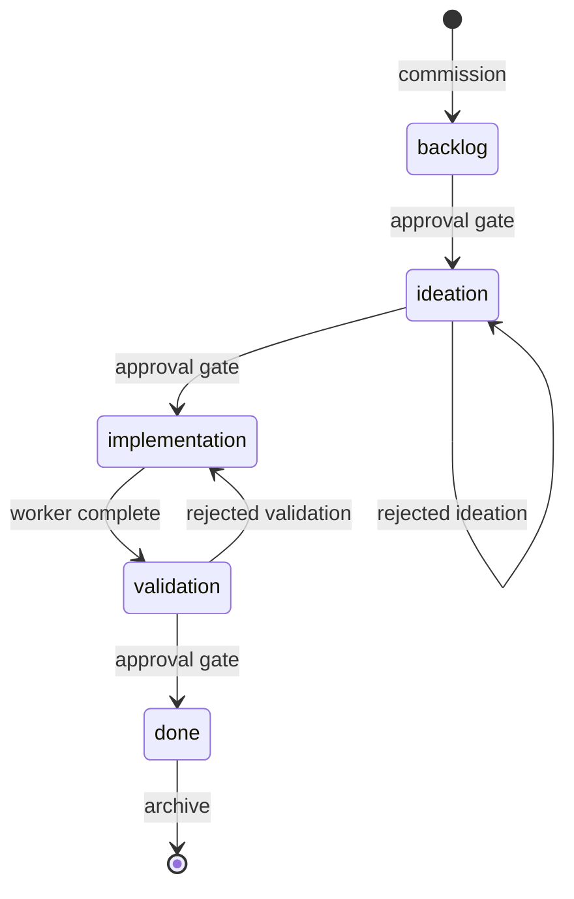

# Spacedock frontmatter and state-machine contract (v1.0)

The machine-checkable contract is the two schemas under [`docs/schema/`](schema/):

- [`schema/workflow-readme.mdschema.yml`](schema/workflow-readme.mdschema.yml) — the workflow `README.md` frontmatter shape and the required per-stage body subsections.
- [`schema/entity.mdschema.yml`](schema/entity.mdschema.yml) — entity frontmatter fields, the custom-field policy, recognized body headings, and the invariants.

Those schemas are the source of truth for field names, types, patterns, defaults, and severities. This page does not restate them; it covers the parts a field table cannot express — directory layout, the parser, worktree-aware reads, the state machine, and versioning. When this prose and a schema disagree, the schema wins. The Go reference behavior lives in `internal/status/`.

## Workflow directory layout

```text
{workflow_dir}/
|-- README.md                    workflow definition (workflow-readme.mdschema)
|-- <slug>.md                    flat entity (entity.mdschema)
|-- <slug>/                      folder entity
|   `-- index.md
|-- _archive/                    archived entities
|-- _mods/                       lifecycle hooks and standing teammates
`-- _debriefs/                   optional session debriefs
```

- Flat (`<slug>.md`) and folder (`<slug>/index.md`) entities are both valid. If both forms exist for one slug, the folder form wins and validation warns that the flat file should be removed.
- `_archive/`, `_mods/`, `_debriefs/`, and `_evidence/` are reserved support directories, not discovered as entities. Hidden entries (names starting with `.`) are skipped.
- The top-level `README.md` is the workflow definition, not an entity.

## Parser semantics

Spacedock parses only simple top-level frontmatter fields, line by line, to keep the contract close to the line-oriented writer.

1. Lines between the opening and closing `---` fences are scanned.
2. A non-indented line containing `:` becomes a top-level key/value pair, split on the first colon.
3. Indented lines are nested content and are ignored by the top-level parser.
4. Matching surrounding single or double quotes are stripped.
5. `key:` with no value is the empty string.
6. Parsing stops at the closing `---` fence.
7. Writes are line-oriented: values are written verbatim, not YAML-escaped.

A new read implementation may use a full YAML library only if it produces the same top-level key set as this parser on the active corpus. The write path must preserve line-oriented update semantics until a major-version change.

## Worktree-aware reading

Worktree-backed stages let a worker edit an isolated copy while the workflow directory keeps minimal discoverable metadata. Readers resolve the active copy before deciding which frontmatter is current.

1. If `worktree` is empty, the active copy is the canonical copy in the workflow directory.
2. If `worktree` is non-empty, the active copy is `<git-root>/<worktree>/<workflow-relative-path>` when that file exists.
3. If the worktree mirror is missing, reads fall back to the canonical copy.
4. When both exist, active-copy frontmatter overlays the canonical copy: active values win, canonical-only values are preserved.
5. `pr` is the only field that mirrors from a worktree-backed active copy back to the canonical copy, so pull-request state stays visible from the workflow root.

## State machine

File location (active vs archived, with or without an active worktree) is separate from stage progress (the `status` field within the workflow's declared stages).

- **Blocked** means `mod-block` is non-empty.
- **Terminal** means `status` equals the one stage marked `terminal: true`.
- **Archived** means the entity has moved under `_archive/`.

The default generated workflow is linear:



`gate: true` makes the first officer present the transition to the captain and wait for approval before leaving the stage. `worktree: true` runs that stage's dispatched work in a worktree. `feedback-to` names the rejection target. Non-linear workflows declare explicit `stages.transitions` edges; the validator checks each endpoint names a declared stage.

### Transition guards

| Transition | Guard |
|------------|-------|
| Any status to terminal | `mod-block` must be empty unless forced. |
| Any status to terminal, when merge hooks are registered | Either `pr` or `mod-block` must be non-empty unless forced, catching a missed merge-hook procedure. |
| Clear `mod-block` and set terminal in one command | Refused unless forced; the audit trail must show clearing the block and terminalizing as separate writes. |
| Archive an entity | `status` must already be terminal; archive does not advance status. |
| Set `worktree=<path>` | No data-layer guard; first-officer procedure decides when a worktree is assigned. |

### Mutation mechanics

- The rewriter performs one read and one write: no temp file, lock, fsync, or rollback.
- The CLI does not invoke git. The first officer commits main-branch workflow state; the worker commits worktree-branch state.
- A successful mutation prints `field: <old> -> <new>` per field; archive prints `archived: <destination>`. Exit code is 0 on success, 1 on refusal or error.

## Entity write scope

- The first officer owns workflow frontmatter on the main branch and mutates it through `spacedock status --set` or related commands.
- For worktree-backed stages, active body and report edits live in the worktree copy.
- Worker agents edit entity body text and project files in their assigned worktree; they do not edit workflow frontmatter.
- The first officer does not edit project code, tests, mods, or scaffolding on main; those go through a dispatched worker.

## Stage report body convention

A worker appends a `## Stage Report: <stage-name>` section at the end of the entity body on stage completion; the first officer reads the last such report when deciding the next transition. Use `DONE:` / `SKIPPED:` / `FAILED:` per checklist item, include every dispatched item, keep evidence short, and append a new `## Stage Report: <stage-name> (cycle N)` section for feedback cycles rather than editing an older report. Schema validation recognizes the report heading but does not validate its prose.

## Validation

`spacedock status --workflow-dir <dir> --validate` is the live checker. It enforces a subset of the schemas: entity-form (flat/folder) conflicts, stage-name regex, per-`id-style` id presence and uniqueness, and (when the workflow opts in) the external-proof policy. It exits 0 when valid, 1 with errors on stderr otherwise. The schemas under `docs/schema/` carry the full field-level contract (types, patterns, per-field severities, invariants) that `--validate` does not yet check end to end.

## Versioning and backward compatibility

- This prose declares `Version: 1.0`; the schema files carry `"version": "1.0"`.
- Workflows advertise their authoring version through `commissioned-by: spacedock@<version>`.
- v1.x may add compatible fields, optional sections, or warn-only conventions. It must not remove canonical fields, make optional fields required, change field types, or tighten a warn-only condition into a fail. Breaking changes require a v2.0 bump.
- An implementation should accept workflows whose `commissioned-by` version is at or below its supported version and refuse a newer unsupported one.
