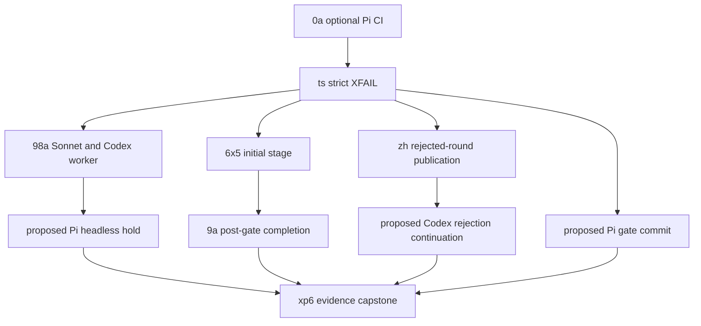

# Test-behavior-completeness sprint

Status: **shaped with Material folds pending**.

Target train: not bound. The captain must bind the release before Commander
dispatch.

## Goal

Make every executable desired live cell current and honest. A cell passes or
runs as strict XFAIL. A cell stays TODO only when its journey cannot run.

Each product repair starts from one committed XFAIL code. The same target then
runs against the exact repair candidate before source removes the binding.

## Membership

The workflow query owns membership. The index does not own lifecycle state.

```bash
# All sprint members
spacedock status --workflow-dir docs/dev \
  --where sprint=test-behavior-completeness \
  --archived

# Drivable members
spacedock status --workflow-dir docs/dev \
  --where sprint=test-behavior-completeness \
  --where 'sprint-readiness != defer'
```

The current query is incomplete. The staff review requires three additional
task entities before gate lock:

- `continue-codex-rejection-after-first-validation`
- `commit-pi-gate-prepare-before-presentation`
- `hold-pi-default-headless-validation-gate`

The staff review defines their exact proposed scope. This index does not create
those entities.

## Completion definition

- Every executable desired cell passes or runs as strict XFAIL.
- TODO remains only when the complete journey cannot run.
- Every TODO and XFAIL names one active owner.
- XFAIL accepts only the sole expected semantic code.
- XPASS fails until source removes the stale binding.
- Infrastructure and additional semantic failures remain FAIL.
- Each product fix starts from a committed XFAIL baseline.
- Each binding removal has exact-target, exact-candidate evidence.
- `TestRuntimeLiveRegistryReconciliation` passes.
- `TestRuntimeLiveTODOOwnersAreActive` passes with the mutable state checkout.
- The final artifact contains the existing journey metrics format only.

## Value and line budget

This table records the package-lock budget. The workflow query remains the
membership authority.

| Member | Visible value | Net-line statement |
| --- | --- | ---: |
| `0a` | A maintainer can run optional Pi CI and retain common and substrate evidence. | Net must not exceed `+380`. The approved reset allows 8 files. |
| `ts` | Sonnet and Codex run the known headless gap as strict XFAIL, and XPASS fails. | Hard cap `+210` net. |
| `98a` | Sonnet and Codex complete the implementation worker before validation. | About `+6` net, tolerance 2 lines. |
| `6x5` | An initial stage runs before its terminal successor. | About `+12` net, tolerance 12 lines. |
| `9a` | A consumed nonterminal gate has one dispatch commit and normal terminalization. | About `+228` net, tolerance 25%. |
| `zh` | Stable recorder-failure targets publish the complete rejected round before re-review. | About `+1` net, tolerance 12 lines. |
| proposed Codex rejection task | Codex completes correction and reaches a fresh final gate. | Initial estimate `+10` net, tolerance 12 lines. |
| proposed Pi gate-commit task | Pi presents only a gate whose binding is committed and reread. | Initial estimate `+12` net, tolerance 12 lines. |
| proposed Pi headless-hold task | Pi stops at the first open validation gate with durable evidence. | Initial estimate `+14` net, tolerance 14 lines. |
| `xp6` | Passing TODO rows disappear, stable failures stay executable, and unexecutable rows stay honest. | Product delta `0` net. |

A new registry, result artifact, host-switch table, copied scenario map, process
controller, or lifecycle model is outside this budget. Such a change requires a
design reset.

## Dispatch and landing graph

The graph shows dependency order. Independent branches can run implementation
work at the same time. Merge authority remains serial because the branches share
source bindings and First Officer contract files.



Use this serial merge order:

1. `0a`
2. `ts`
3. `98a`
4. `6x5`
5. `9a`
6. `zh`
7. the proposed Codex rejection task
8. the proposed Pi gate-commit task
9. the proposed Pi headless-hold task
10. `xp6`

Before each repair baseline, rebase onto the last landing. Then commit its XFAIL
binding and run the exact target. Product bytes come only after that evidence.

## Lane policy

Pull-request merge evidence requires Claude Sonnet 5 at maximum effort and Codex
Luna at maximum effort when the diff touches their live surface.

Opus is pre-release evidence. Pi is optional manual evidence. Neither gives the
Commander authority to skip a required Sonnet or Codex lane.

Use local subscription-backed runs before paid CI. Use isolated artifact roots
for concurrent live runs.

## Exclusions

`g3` and all durable-decisions work are explicitly excluded. The Commander has
no dispatch, review, mutation, approval, or merge authority for that lane.

Task `47g` is also outside sprint membership. Passed Codex withdrawn-gate
evidence permits removal of its stale TODO without bringing `47g` into scope.

Archived `nv`, `26n`, `3z`, and `zbc` stay archived. Their evidence remains
readable and their entities do not return to this sprint.

## Readiness gate

The Commander package remains blocked until the five Material findings in
`staff-review.md` are folded. The Shaping FO must create and ideate the three
proposed tasks, update affected task bodies, and record their gate attempts.
