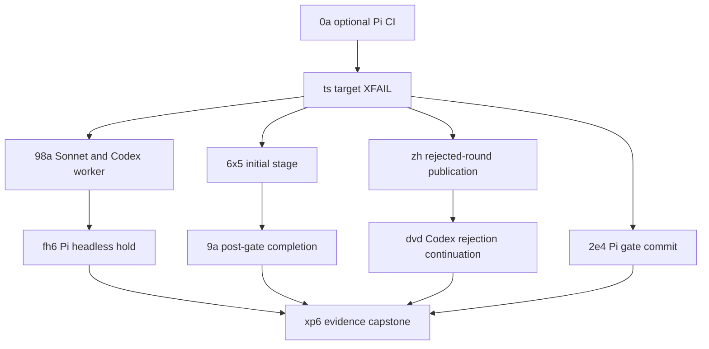

# Test-behavior-completeness sprint

Status: **staff-review clean. Commander activated**.

Target train: **`next` development line**.

Stable release tagging is outside Commander authority. A stable tag needs a
separate captain grant and the release procedure from `main`.

## Goal

Make every executable desired live cell current and honest. A cell passes or
runs as target-level XFAIL. A cell stays TODO only when its target cannot run.

Each product repair starts from one committed XFAIL target. The same target then
runs against the exact repair candidate before source removes the binding.

## Canonical references

- [Live CI policy](../../runtime-live-ci.md)
- [Live CI registry](../../runtime-live-ci-registry.md)

## Membership

The workflow query owns membership. The index does not own lifecycle state.

```bash
# Raw sprint-label audit, including archived history and excluded g3
spacedock status --workflow-dir docs/dev \
  --where sprint=test-behavior-completeness \
  --archived

# Drivable members
spacedock status --workflow-dir docs/dev \
  --where sprint=test-behavior-completeness \
  --where 'slug != define-fo-moving-target-conflict-ownership' \
  --where 'sprint-readiness != defer'
```

The current query contains all retained implementation members. Archived rows
remain historical evidence and are not drivable. The explicit slug filter keeps
`g3` in the durable-decisions lane.

## Completion definition

- Every executable desired cell passes or runs as target-level XFAIL.
- TODO remains only when the complete journey cannot run.
- Every TODO and XFAIL names one active owner.
- XFAIL accepts one or more typed semantic failures from its target.
- XPASS is green and emits an alert. Its binding remains until removal after exact proof.
- Infrastructure failures remain FAIL.
- Each product fix starts from a committed XFAIL baseline.
- Each binding removal has exact-target, exact-candidate evidence.
- `TestRuntimeLiveRegistryReconciliation` passes.
- `TestRuntimeLiveTODOOwnersAreActive` passes with the mutable state checkout.
- The final artifact contains the existing journey metrics format only.

## Value and line budget

This table records the package-lock budget. The workflow query remains the
membership authority.

| Member | Visible value | Net-line statement |
| --- | --- | ---: |
| `0a` | A maintainer can run optional Pi CI and retain common and substrate evidence. | Net must not exceed `+380`. The approved reset allows 8 files. |
| `ts` | Every executable sprint target runs as target-level XFAIL, and XPASS fails. | Estimate `+285` net, tolerance `+25`. |
| `98a` | Sonnet and Codex complete the implementation worker before validation. | About `+6` net, tolerance 2 lines. |
| `6x5` | An initial stage runs before its terminal successor. | About `+12` net, tolerance 12 lines. |
| `9a` | A consumed nonterminal gate has one dispatch commit and normal terminalization. | About `+228` net, tolerance 25%. |
| `zh` | Pi publishes the complete rejected round before re-review. | About `+2` net, tolerance 12 lines. |
| `dvd` | Codex completes correction and reaches a fresh final gate. | About `+26` net, tolerance 14 lines. |
| `2e4` | Pi presents only a gate whose binding is committed and reread. | About `+14` net, tolerance 12 lines. |
| `fh6` | Pi stops at the open validation gate with zero terminal fields. | About `+12` net, tolerance 14 lines. |
| `xp6` | Passing TODO rows disappear, stable failures stay executable, and unexecutable rows stay honest. | Product delta `0` net. |

A new registry, result artifact, host-switch table, copied scenario map, process
controller, or lifecycle model is outside this budget. Such a change requires a
design reset.

## Dispatch and landing graph

The graph shows dependency order. Independent branches can run implementation
work at the same time. Merge authority remains serial because the branches share
source bindings and First Officer contract files.



Use this serial merge order:

1. `0a`
2. `ts`
3. `98a`
4. `6x5`
5. `9a`
6. `zh`
7. `dvd`
8. `2e4`
9. `fh6`
10. `xp6`

Before each repair baseline, rebase onto the last landing. Use the XFAIL binding
that `ts` assigned to the repair owner. Product bytes come only after that evidence.

## `0a` cold-boot recovery

`0a` is part of Commander dispatch. It is not complete.

The registered checkout is
`.worktrees/spacedock-ensign-restore-optional-manual-pi-common-live-ci`. Its
registered branch is
`spacedock-ensign/restore-optional-manual-pi-common-live-ci`. The observed tip is
`e838fba69` (`ci: restore exclusive manual Pi live cadence`).

The entity has no implementation Stage Report. On cold boot, the Commander must
converge the workflow and reconcile these facts before reuse or fresh dispatch.
The Commander must also check active owner availability. Normal ownership and
dispatch rules decide whether the work resumes or gets a fresh worker.

Validate and merge `0a` before `ts`.

## Lane policy

Pull-request merge evidence requires Claude Sonnet 5 at maximum effort and Codex
Luna at maximum effort when the diff touches their live surface.

Opus is pre-release evidence. Pi is optional manual evidence. Neither gives the
Commander authority to skip a required Sonnet or Codex lane.

Use local subscription-backed runs before paid CI whenever possible. Use
isolated artifact roots for concurrent live runs.

## Exclusions

`g3` and all durable-decisions work are explicitly excluded. The Commander has
no dispatch, review, mutation, approval, or merge authority for that lane.

Task `47g` is also outside sprint membership. Passed Codex withdrawn-gate
evidence permits removal of its stale TODO without bringing `47g` into scope.

Archived `nv`, `26n`, `3z`, and `zbc` stay archived. Their evidence remains
readable and their entities do not return to this sprint.

## Activation record

The staff review has no open Material finding. The captain approved all nine
ideation gates, bound the target train to `next`, and activated the Commander.

The Commander has the conn toward the sprint goal. Environment approvals and
stable release tags remain outside this authority unless the captain grants
them separately.
