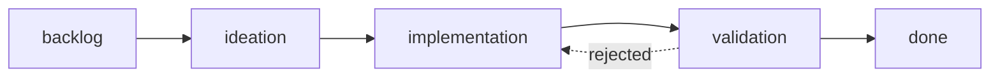

# The stage lifecycle

An entity moves through an ordered chain of stages that the workflow defines, and each stage declares the work it owns and the proof it must produce. The first officer advances an entity stage by stage, pausing at the gates you declared.

## A typical dev workflow

Read the chain as a pipeline: each stage takes the prior stage's output as its input, and the bar rises from "is this clear?" to "is this proven?". Here ideation and validation end at gates: your call before code is written, and your call before the result ships.

The property that matters most is `feedback-to`: rejected work bounces back to the stage that owns the fix (a rejected validation returns to implementation), not to the reviewer that flagged it.

## What a stage declares

The stage order, names, and the properties each stage carries live in the workflow README's frontmatter under `stages.states`. Each entry is a stage name plus a set of boolean or string properties the first officer reads to decide how to dispatch and when to stop. A `stages.defaults` block sets the baseline; a stage entry overrides it. The properties that change behavior:

| Property | Effect |
|----------|--------|
| `initial: true` | The stage an entity starts in. The dev workflow marks `backlog`. |
| `terminal: true` | The stage an entity ends in. Reaching it runs the merge and cleanup ceremony, not another dispatch. The dev workflow marks `done`. |
| `gate: true` | The first officer presents a stage report and waits for your decision instead of advancing on its own. |
| `worktree: true` | The stage's work runs in an isolated git worktree. Absent or `false`, it runs inline. |
| `fresh: true` | The stage always gets a freshly dispatched ensign, never a worker reused from the prior stage. |
| `feedback-to: {stage}` | On rejection, work routes back to the named stage rather than failing outright. |
| `concurrency: N` | How many entities may sit in this stage at once. |
| `agent: {name}` | Which worker skill the first officer dispatches. Defaults to `ensign`. |

Beyond these properties, the prose of each stage's `###` subsection in the README is the stage definition: its Inputs, Outputs, and the Good/Bad bar. What you write there is exactly what the worker receives as its assignment.

## Fresh context at validation

Validation declares `fresh: true` because the reviewer must not be the maker. The validator arrives without the implementer's reasoning in its context, sees only the entity body and the deliverable, and pushes back on thin evidence. This is the mechanism behind the README's claim that "the agent doesn't get to judge its own work."

When validation recommends `REJECTED`, `feedback-to: implementation` routes the concrete finding back to the implementation stage for rework rather than closing the entity. The entity re-enters implementation, the finding is addressed, and a fresh validator checks it again. A hard cap on feedback cycles prevents an endless bounce; on the third cycle the first officer escalates to you.

## Worktree vs. inline

A stage runs in an isolated git worktree when it declares `worktree: true`, and inline at the repo root otherwise. This is the "isolation when it matters" tradeoff: stages that mutate shared state (implementation, validation) get their own checkout so concurrent entities don't collide; lighter stages that only edit the entity body (backlog, ideation) run inline.

The first officer manages the isolation for you: it creates the worktree on first dispatch, the stage's work and commits stay inside that checkout, and at the terminal stage it merges the branch and cleans the worktree up. In a [split-root workflow](../advanced/split-root-state.md) the entity file itself lives in the state checkout; the worktree isolates only the deliverable.

## Where to go next

- [The operating model](operating-model.md) for who does what: you, the orchestrator, the workers.
- [Gates and decisions](gates-and-decisions.md) to see exactly what you decide at a stage boundary and on what evidence.
- The [frontmatter contract](../reference/frontmatter-contract.md) to look up the fields these stages write.
