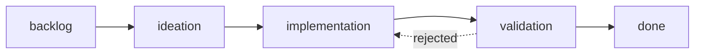

# The stage lifecycle

An entity moves through an ordered chain of stages that the workflow defines, and each stage declares the work it owns and the proof it must produce. The first officer advances an entity stage by stage, pausing at the gates you declared.

## A typical dev workflow

Read the chain as a pipeline: each stage takes the prior stage's output as its input, and the bar rises from "is this clear?" to "is this proven?". Here ideation and validation end at gates: your call before code is written, and your call before the result ships.

The property that matters most is `feedback-to`: rejected work bounces back to the stage that owns the fix (a rejected validation returns to implementation), not to the reviewer that flagged it.

## What a stage declares

A stage can pause at a gate for your decision, run its work in an isolated worktree, demand a reviewer with no access to the maker's reasoning, route rejected work back to an earlier stage, cap how many items it holds at once, and hand its work to a specialist worker. All of it is declared in the workflow README; ask the first officer to set up or change any of it.

Beyond the declarations, the prose of each stage's section in the README is the stage definition. What you write there is exactly what the worker receives as its assignment.

## Fresh context at validation

Validation declares `fresh: true` because the reviewer must not be the maker. The validator arrives without the implementer's reasoning in its context, sees only the entity body and the deliverable, and pushes back on thin evidence. This is the mechanism behind the README's claim that "the agent doesn't get to judge its own work."

When validation recommends `REJECTED`, `feedback-to: implementation` routes the concrete finding back to the implementation stage for rework rather than closing the entity. The entity re-enters implementation, the finding is addressed, and a fresh validator checks it again. A hard cap on feedback cycles prevents an endless bounce; on the third cycle the first officer escalates to you.

## Worktree vs. inline

A stage runs in an isolated git worktree when it declares `worktree: true`, and inline at the repo root otherwise. This is the "isolation when it matters" tradeoff: stages that mutate shared state (implementation, validation) get their own checkout so concurrent entities don't collide; lighter stages that only edit the entity body (backlog, ideation) run inline.

The first officer manages the isolation for you: it creates the worktree on first dispatch, the stage's work and commits stay inside that checkout, and at the terminal stage it merges the branch and cleans the worktree up. In a [split-root workflow](../advanced/split-root-state.md) the entity file itself lives in the state checkout; the worktree isolates only the deliverable.

## Where to go next

- [The operating model](operating-model.md) for who does what: you, the orchestrator, the workers.
- [Gates and decisions](gates-and-decisions.md) to see exactly what you decide at a stage boundary and on what evidence.
- The [frontmatter contract](../reference/frontmatter-contract.md) to look up the fields these stages write.
