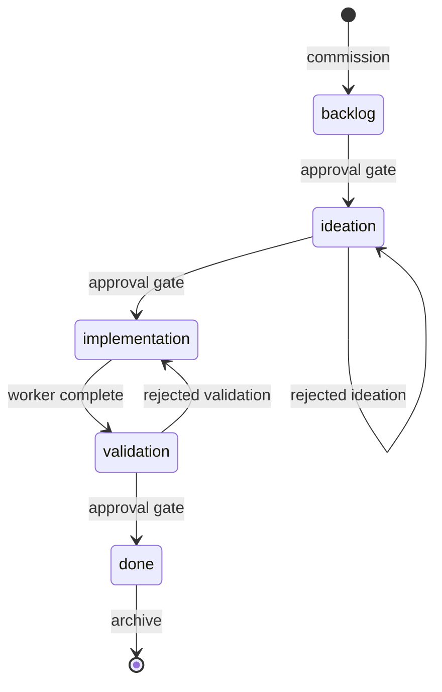

# Frontmatter contract

Every entity is a markdown file (`{slug}.md`, or a folder `{slug}/index.md` when reports and artifacts pile up beside it). Its YAML frontmatter is the machine-readable state Spacedock reads to track and move it; the body below is the human record (problem, approach, acceptance criteria, stage reports).

The field-level contract (names, types, patterns, defaults, invariants) is the two machine-checkable schemas:

- [`workflow-readme.mdschema.yml`](https://github.com/spacedock-dev/spacedock/blob/main/docs/schema/workflow-readme.mdschema.yml) — the workflow `README.md` frontmatter and the required per-stage body subsections.
- [`entity.mdschema.yml`](https://github.com/spacedock-dev/spacedock/blob/main/docs/schema/entity.mdschema.yml) — entity frontmatter fields, the custom-field policy, recognized body headings, and the invariants.

Those schemas are the source of truth. This page covers what a field table can't: how the frontmatter is parsed, how worktree-backed reads resolve, and how an entity moves through stages. When this page and a schema disagree, the schema wins.

## A development-workflow entity

The fields you see most often are the ones the development workflow declares for a `task`. Other workflows rename the entity type and adjust the set, but the shape is the same. A new entity ships with these blank, and the runtime fills the rest as the entity moves:

```yaml
---
id:
title: Task name here
status: backlog
source:
started:
completed:
verdict:
score:
worktree:
issue:
---
```

You fill `title`, `status`, and `source` at creation. `status` is the execution state: it names the current stage (`backlog`, `ideation`, `implementation`, `validation`, `done` for this workflow), and the first officer advances it as work moves. The runtime owns `started`, `completed`, `verdict` (`PASSED` or `REJECTED` at the [final gate](../concepts/gates-and-decisions.md#the-three-calls)), and `worktree`; don't hand-edit those while a dispatched agent is active.

## Keep fields flat

Spacedock parses only simple top-level frontmatter, line by line:

- A non-indented `key: value` line becomes a field; the value is split on the first colon and surrounding quotes are stripped.
- Indented lines are treated as nested YAML and ignored. Add more flat custom fields rather than nesting; custom keys are preserved, filterable, and shown in all-field output.
- `key:` with no value is the empty string. Parsing stops at the closing `---`.

## Worktree-aware reading

A worktree-backed stage edits an isolated copy while the workflow directory keeps minimal discoverable state. Readers resolve the active copy before trusting any field:

- Empty `worktree`: the active copy is the canonical file in the workflow directory.
- Non-empty `worktree`: the active copy is the matching file under `<git-root>/<worktree>/` when it exists; if it's missing, reads fall back to the canonical copy.
- When both exist, active-copy fields overlay the canonical copy. `pr` is the only field mirrored back to the canonical copy, so pull-request state stays visible from the workflow root.

## How an entity moves

File location (active vs archived) is separate from stage progress (the `status` field). The default workflow is linear, with a gate before the terminal stage and a rejection path back from validation:



The first officer commissions at `backlog`, gates ask you to approve before leaving a stage, validation can bounce back to implementation on a rejection, and `done` archives. A few guards protect the terminal move: an entity with a non-empty `mod-block` (a lifecycle hook still in flight) won't terminalize without force, and clearing a block and terminalizing must be two separate writes so the audit trail stays honest. Archiving requires the entity to already be terminal.

## External-tracker fields

`issue` and `source` bridge to an external ledger (Linear, GitHub Issues). `issue` is the human-facing ticket reference; `source` records the origin. The tracker keeps owning intake and discussion; Spacedock `status` stays the execution state. See [Bridge an external tracker](../advanced/external-tracker.md) for the model.

## Validating a workflow

```bash
spacedock status --workflow-dir docs/dev --validate
```

It checks entities against the contract and exits 0 when valid, 1 with errors on stderr. It enforces a subset of the schemas (entity-form conflicts, stage-name rules, id uniqueness, and the opt-in external-proof policy); the schemas above carry the full field-level contract.
