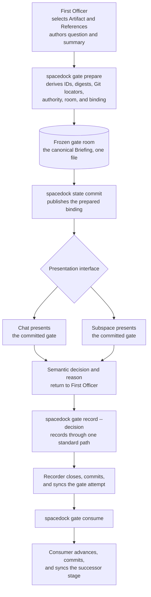

# Gate Resolution frontmatter contract

Status: implemented recorder and application contract
Date: 2026-07-22

## Outcome and ownership

The recorder makes a captain's decision durable before any workflow status change or
dispatch. It owns the logical gate, ordered attempts, immutable Briefing binding, and
portable Resolution. A closed approval carries the typed one-use `application`
subtree; revise and hold are complete Resolutions with no application. The same
recorder binary owns its guarded writes.

Stable v1 permits chat or Subspace to present the committed gate; presentation is not
a recorder verb. Both channels return semantic decision and reason input to the First
Officer, who uses `gate record --decision` after presentation.

## End-to-end gate lifecycle

The lifecycle begins with a prepared, durably committed gate room and ends with one
recorder-owned closed attempt. The First Officer chooses review content and selects
chat or Subspace for presentation; Spacedock prepares and records authority.



## Canonical v1 schema

The binary accepts and emits one canonical `gates:` shape:

```yaml
gates:
  version: 1
  records:
    - id: gate:example:sample:validation
      stage: validation
      attempts:
        - id: gate-attempt:sample-validation-1
          briefing:
            id: briefing:sample-validation-1a
            digest: sha256:3333333333333333333333333333333333333333333333333333333333333333
            request-digest: sha256:4444444444444444444444444444444444444444444444444444444444444444
            room-ref: ./review/validation/briefing-1
          resolution:
            type: Resolution
            id: resolution:captain-sample-validation-1a
            briefing: briefing:sample-validation-1a
            by: person:captain
            at: 2026-07-22T09:00:00Z
            decision: approve
          application:
            target-stage: done
            state: pending
```

`records` and `attempts` are ordered. The last attempt in a record is current. An
attempt is open when both `withdrawal` and `resolution` are absent, withdrawn when only
`withdrawal` is present, and closed when only `resolution` is present. Withdrawn and
closed attempts are frozen. Entity `status` selects exactly one record by its `stage`;
duplicate stage records fail closed. The last ordered attempt in that record is current
and eligible for later application. These facts remove any need for separate attempt pointers, sequence
numbers, lineage pointers, or explicit lifecycle state.

The binary-owned model is closed for canonical validation and writes. In particular,
the pilot-only attempt selector, `current-attempt`, `sequence`, `previous-attempt`,
and explicit attempt `state` encodings are rejected. A read tolerates unknown keys
only under each `records[*].attempts[*].application` mapping, reports them as warnings
on explicit `status --validate`, ignores them for authority, and
never writes them. A read also drops the retired
`records[*].attempts[*].provider-evidence` key silently: its writer was cut with
provider-backed closure, frozen archived records still carry it, and it is retired
rather than unknown, so it raises no warning and never reaches the model. All other
unknown or malformed fields fail closed. There is no migration or compatibility
rewrite. The `application` field is an approval-only
authority token whose canonical fields are exactly `target-stage` and `state`, where
state is `pending`, `consumed`, or `superseded`. Revise and hold carry no application.

Every Briefing binding includes an id, canonical SHA-256 digest, and an exact file or room
reference. Version 1 digests are unconditionally RFC 8785/JCS canonical Briefing JSON
bytes. A request-backed room additionally freezes its
request digest; that request names the canonical Briefing with a clean room-relative
locator, id, and digest. No reader infers a canonical basename.

A prepared room is one file: the canonical Briefing, named `index.json`. Its binding
carries no `request-digest`. A binding whose `room-ref` names a directory that does not
hold `briefing.json` is a prepared room. Rooms prepared before this change hold
`gate-briefing.json` and `request.json`, and bind the JCS digest of that request. They
stay readable, and they keep the full request validation. No room migrates. Changing the
located Briefing, the retained request, or a selected Git object after the attempt binds
therefore fails before semantic decision recording or entity mutation.

The recorder is the authority wall. A presentation channel materializes the room and can
recompute what it reads. Only the recorder compares the room against the entity binding,
under the entity lock. Every mutating verb runs that comparison before it writes.

## Provider-neutral preparation

`gate prepare` is the single mechanical operation that turns First Officer judgment and
committed file selections into an open recorder-ready attempt:

```text
spacedock gate prepare ENTITY --question TEXT --artifact REVIEW.md --summary TEXT \
  [--reference FILE ...] [--workflow-dir DIR]
```

The caller supplies exactly one question, Markdown primary Artifact, and nonblank
valid-UTF-8 primary summary; References may repeat in caller order. Spacedock preserves
the summary string exactly, assigns deterministic ordinal item identities, and derives
the gate, attempt, Briefing, Captain authority, digests, and room. It writes only
`index.json` at preparation time. Readers resolve the canonical Briefing by name:
`index.json` first, then the earlier `gate-briefing.json`. Preparation copies no selected
source, writes no association, and creates no provider subtree.

The room layout is the same for both entity forms:

```text
<state-root>/<slug>/review/<stage>/briefing-<attempt>/
```

but `room-ref` is written relative to the entity file's own directory, so folder form
binds `./review/...` while flat form binds `./<slug>/review/...`. Only the folder-form
ref is invariant under a later move of the entity. A workflow states which form it
keeps with `entity-form: folder` in its README frontmatter, and where that declaration
is present preparation refuses to create the first room beside a flat `<slug>.md`,
whose `<slug>/` companion would hold refs that break on conversion. A workflow that
declares no form accepts either shape and preparation refuses neither. Flat entities
that already hold rooms are grandfathered under the declaration, and their
slug-prefixed refs stay correct while they stay flat; converting one requires
`git mv <slug>.md <slug>/index.md` and rewriting every `room-ref: ./<slug>/` to
`room-ref: ./` in the same commit, and `status --validate` reports both the
grandfathered shape and any ref that stops resolving. State commit and archive
operations continue to treat the flat
Markdown plus companion directory as one literal path-scoped unit, including tracked
deletions and rollback, without sweeping siblings.

Each selected source is a readable, committed, non-symlink regular file owned by the
workflow's `main` or distinct `state` Git history. Its closed identity is
`git-root://<main|state>/<full-commit>/<canonically-escaped-repository-path>` and its
`rev` is the full raw-byte SHA-256. Preparation compares the selected worktree bytes
with `<commit>:<path>`; later operations reopen only that local Git object. They never
fetch, deepen, hydrate, retain a ref, search another checkout, or fall back to current
worktree bytes. A clean detached or linked worktree is valid when it shares the
expected Git history and the object is local.

The primary Artifact alone carries the exact caller-supplied `summary`. References
carry none. Advisory-round Briefings remain summary-free. Exact prepare replay is a
no-op, divergent occupancy fails closed, and
handled validation, publish, or bind failure removes the new candidate and any
newly-created empty parents. Success prints exactly `room`, `briefing`, `digest`, and
`state=open` lines; the emitted absolute room is the only later handoff coordinate.

## Recorder lifecycle

`spacedock gate prepare` is the First Officer's normal lifecycle entry. With no record
for the current stage it opens the first attempt. Exact replay of the current open room
is a no-op; divergent open occupancy fails closed. After a withdrawn or closed attempt,
preparation appends a successor while earlier authority remains frozen; only a closed
attempt may have a pending application to supersede.

`spacedock gate withdraw ENTITY --reason TEXT` retires only the selected current-stage
open prepared attempt. Under the shared lock it validates all retained authority
and requires the room to contain exactly the file set its binding implies. It
records only `withdrawal: {by: agent:first-officer, at: <UTC>, reason: <TEXT>}`: no
Resolution, provider evidence, application, status change, successor, or room write.

`spacedock gate record` accepts a semantic chat decision and closes only the last open
attempt for the current stage. Approve derives one `application` with
`target-stage` and `state: pending`; revise and hold write no application.
In a split-root workflow, a successful close commits and synchronizes its own write.
`gate record --decision approve --consume` is the shortest approval path: it closes,
syncs, consumes, and syncs in one invocation.

Before an ordinary close, the recorder resolves authoritative current status in the
workflow taxonomy and requires a nonterminal `gate: true` stage. The bound Briefing must use the canonical v1 stage-qualified identity and name that same stage. Malformed identity, mismatch, or non-actionable stage fails before Resolution construction and leaves entity bytes unchanged.

Cross-logical-gate re-entry is ordinary: workflow stage selects the target record even
when another stage's closed gate is retained in history. The successful write selects the
target record but does not modify either record's earlier closures.

## Round records (workflow-neutral correction evidence)

A correction round reuses the recorder vocabulary without becoming a gate: its reviewed
snapshot is an immutable, digest-bound Briefing; same-Briefing Annotations and
Resolutions are retained in an ordered review log. Round entries carry no application,
do not select a logical gate, and cannot advance workflow status. Finding labels,
materiality, disposition, ownership, and any workflow prose are opaque to the generic
recorder and remain the responsibility of the active workflow and First Officer.

`spacedock gate record <entity> --round STAGE/CYCLE --briefing PATH/briefing.json
--log PATH/briefing.review.jsonl` publishes the canonical two-file room at
`review/<stage>/round-<cycle>`, then atomically writes the exact `review-round` pointer.
The producer does not parse or write a `### Feedback Cycles` section. A workflow may
append its authorized Cycle line before invoking the producer; the recorder preserves
that body byte-for-byte. The published round is the durable evidence; `gate record
--round` reports every Resolution as advisory structural evidence on publication.

Round recording requires a folder-form entity at `<slug>/index.md`, so its accumulating
`review/` artifacts are scoped beside that entity. Flat entities refuse before locking
or writing; the recorder does not alter the approved derived room path to compensate.
`STAGE` must name a stage in the workflow definition, but need not equal current
`status`: explicit historical backfill remains supported.

The room is immutable: exact whole-room replay is a whole-tree no-op; any different
Briefing, log, room shape, or pointer fails closed. New-room publication rolls back if
the full-entity compare-and-swap or atomic pointer replacement fails.

Narrowing a value AC to make a finding pass is not a round disposition. It opens a real
gate attempt whose binding Resolution is captain-owned; the correction loop cannot
self-approve that design reset.

## Write boundary and invariants

Ordinary recorder operations rebuild only the canonical `gates:` subtree. Consumption of a
non-terminal target co-writes `status` and `application.state: consumed` in one atomic
replacement. Consumption of a terminal-target approval is mechanism-agnostic routing,
not a spend: it writes nothing, leaves the application `pending` and the status at the
gated stage, and returns the `approved-awaiting-merge` route; a repeated consume is
idempotent re-routing. The terminal merge ceremony (`spacedock merge guard`) is the
sole terminal consumer: with delivery proof it clears the `mod-block` in its
own step, then writes, in one locked replacement, `application.state:
pending→consumed` plus the terminal status, `verdict`, and `completed` — the
`pr` merge sentinel is retained through archive as durable delivery proof —
and a non-forced `status --set` to a terminal stage is refused while a
pending terminal-target application is in force. `merge guard --rework` writes
`application.state: pending→superseded` with `status :=` the record stage's declared
`feedback-to` and delivery state cleared — through the same guarded application
mutation; it refuses when no pending terminal-target application exists or when the
declared `feedback-to` is missing, undefined, or terminal. Before replacement it
validates the rebuilt full entity and compares the locked source subtree with the one it
read, so stale or invalid writes fail without replacing the file. All frontmatter fields
outside `gates` and the Markdown body are preserved byte-for-byte. The per-entity lock
rejects concurrent recorder writers; there is no retry, lease, daemon, or recovery
protocol.

A consumed nonterminal application is ordinary history after it enters its
non-gated successor. After the worker report is durable, ordinary atomic
terminal fields can complete that successor without `--force`. Pending,
unreadable, stale, superseded, and terminal-target authority still fails closed.

The model enforces unique gate, stage, attempt, Briefing, and Resolution ids; a unique
status-matched logical gate when one exists; non-empty attempt histories; exact Resolution-to-Briefing binding;
and portable `approve`, `revise`, or `hold` decisions. `revise` and `hold` require a
reason or an included same-Briefing Annotation. Withdrawals require fixed
`agent:first-officer` attribution, a UTC timestamp, a nonblank reason, and a valid
request digest. Open attempts cannot carry provider evidence or application data;
withdrawn attempts can carry neither Resolution, provider evidence, nor application.

## Command surface

```text
spacedock gate prepare ENTITY --question TEXT --artifact REVIEW.md --summary TEXT [--reference FILE ...] [--workflow-dir DIR]
spacedock gate withdraw ENTITY --reason TEXT [--workflow-dir DIR]
spacedock gate record ENTITY --decision approve|revise|hold --actor ID [--reason TEXT] [--conn-quote TEXT --conn-source TEXT] [--consume] [--workflow-dir DIR]
spacedock gate record ENTITY --round STAGE/CYCLE --briefing PATH/briefing.json --log PATH/briefing.review.jsonl [--workflow-dir DIR]
spacedock gate consume ENTITY [--workflow-dir DIR]
```

The decision and actor are required. Supported chat actor IDs are `person:captain` and `agent:first-officer`. The binary derives operation, ids, stage target,
and compare-and-swap state; callers cannot submit an operation envelope or candidate
identities.

New delegated chat resolutions use `by: agent:first-officer`, require a nonblank
evidence reason, and require a conn citation (`conn: {quote, source}`) naming the
grant verbatim and where it was given; they reject `adoption-note` as an unknown
prototype field. A citation is refused on `person:captain` resolutions. The recorder
constructs the portable Resolution under the asserted identity that rendered the
decision; it records the cited grant without authenticating chat, and does not
apply the result.

## Explicitly outside v1

- Prototype-format compatibility, migration, and arbitrary
  unknown-field preservation inside `gates`.
- Provider-specific room-backed recording, `gate record --room`, Result or inventory
  ingestion, retained provider evidence, and provider package selection. Subspace may
  present the committed gate, but its semantic decision and reason use `--decision`.
- Remote Git-object acquisition, retention refs, copied selected-source payloads, or
  generic URI/root registries.
- Blocker-satisfaction evaluation, execution-hold authoring, dispatch identities, or effect receipts.
- A second schema version or provider operation envelope.

## Behavioral proof

The release tests must fail if any of these outcomes regress:

1. Open/rebind/close/successor behavior changes, or a successor mutates a frozen closure.
2. Cross-gate re-entry follows current workflow stage rather than historical records.
3. A prototype field or arbitrary unknown binary-owned field becomes readable or writable.
4. A stale, invalid, or lock-contended write changes the entity.
5. A canonical write changes bytes outside `gates` or alters opaque application data.
6. A presentation interface bypasses `gate record --decision` or changes the committed
   gate it presents.
