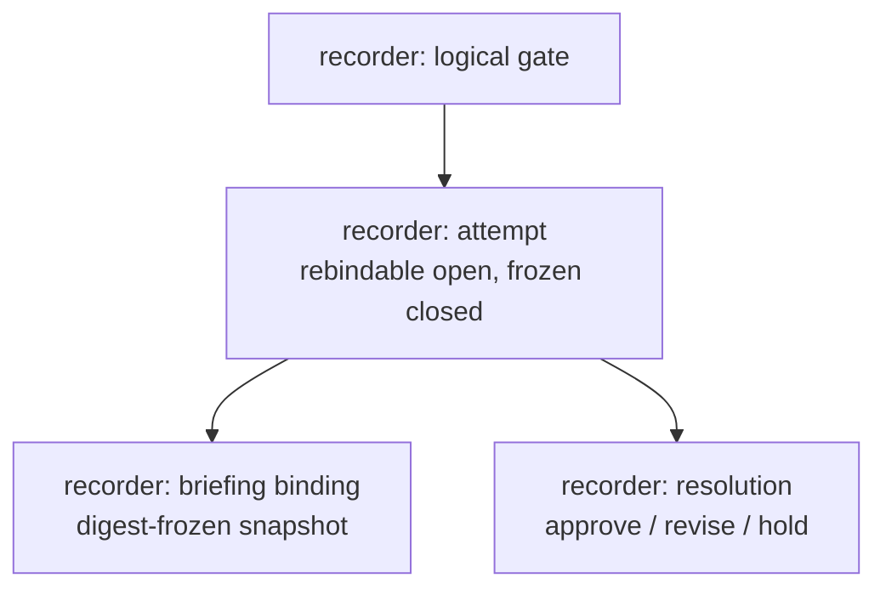
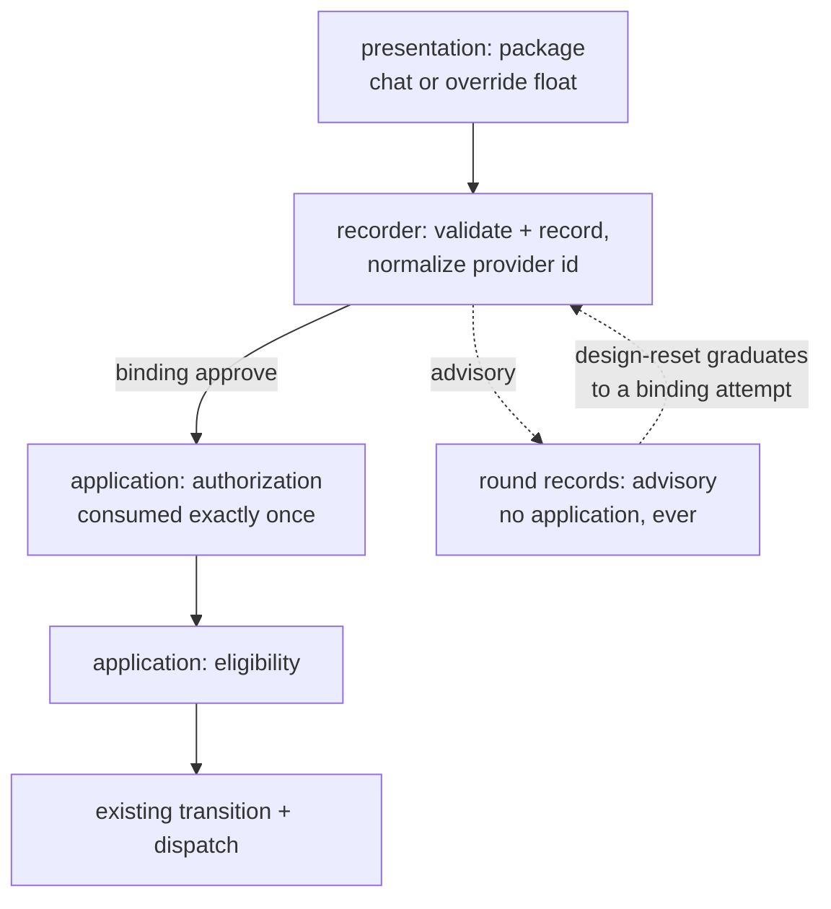

# Gate Resolution frontmatter contract

Status: implemented recorder contract
Date: 2026-07-19

## What the recorder ships first


The recorder separates a captain's gate decision — the resolution (what the decision *is*)
— from the workflow action that follows it — the application (what the decision *does*),
owned by the application layer per the captain's 2026-07-21 resolution-first split.
The recorder's first implementation ships:

1. A gate attempt and its current immutable Briefing are directly readable from the
   entity's `gates` frontmatter.
2. The exact authenticated Resolution can close that attempt without changing
   `status`, routing feedback, or dispatching a worker.
3. Status can show the recorded resolution states — a recorded `approve`, `hold`, or
   `revise` — after restart. (The approved-pending/approved-held/stale/consumed
   application-eligibility surfacing is owned by the application layer.)
4. **(The application layer.)** Once the guards pass, the First Officer applies
   the recorded action once through the existing workflow transition and dispatch path.
   The gate record does not create a second dispatch protocol.

The ownership shape, in two small stacked views. First, the record the recorder owns — one logical
gate holds attempts, and each attempt binds one briefing and one resolution:



Second, the flow across owners — the presentation command obtains the decision, the
recorder records the resolution, the application layer applies it once eligible, and round
records stay advisory:



The design-reset edge is drawn to the resolution to keep one column; semantically it opens
a NEW binding attempt on the gate.

The first use begins when the First Officer needs captain input before recommending a
gate:

> This design would benefit from your input before I can recommend it at the gate.
> Normally I would relay your comments to the ensign. Would you like to try Subspace
> so the ensign can show you the complete design, receive your annotations directly,
> and revise it before I bring it back for approval? [Y/n]

Presentation is an **overridable channel of the present-gate skill**, not a recorder
verb. The default channel is chat: the First Officer renders the gate-review template in
conversation and records the captain's chat resolution through the recorder, exactly as
every gate is recorded. A workflow or session may declare an **override channel** — a
provider-owned hardened script (a Subspace float) that presents the design as a briefing
package in one blocking review and returns a retained result. Selecting the override
probes the presenter (`subspace-tui` and the Subspace review skill, version-gated) before
any side effect; if it is absent or version-mismatched, the selection falls back to chat,
emitting one line that names both the install remedy and the fallback, with zero side
effects and no retention directory created. A missing presenter is an ordinary condition
selecting the chat channel — not a mode, and it never blocks the gate. The install remedy
the fallback names:

```sh
brew install spacedock-dev/tap/subspace-beta

claude plugin marketplace add spacedock-dev/marketplace
claude plugin install subspace@spacedock

codex plugin marketplace add spacedock-dev/marketplace
codex plugin add subspace@spacedock
```

On yes, the First Officer uses `followup_task` on the still-addressable gate-attempt
ensign and invokes the override channel. The override script assembles the complete
Briefing, binds a frozen snapshot of the available provider-owned Probe input and history
as supporting `Reference` context, runs the presenter as one blocking child, and writes
the result **room-resident from the first byte to a caller-owned path the script never
deletes** — so the result survives launcher death, validation failure, and the
leave-open/hold path. Creating a Zellij pane or session is only launch progress; it never
means the review completed. The gate-attempt ensign remains unresolved and addressable for
that whole blocking call; the First Officer waits with `wait_agent({timeout_ms:300000})`
and, if the wait times out while the ensign is still active, waits again rather than
treating the timeout as completion or failure.

The **recorder** — not the presentation channel — validates the returned result and
records the resolution. It verifies the returned artifact digest against the digest bound
by the attempt Briefing, and only on a digest match normalizes the provider envelope
briefing id to the attempt briefing id; on a mismatch it rejects without normalizing, so
an unverified result is never laundered into the attempt id. Result validation and
id-normalization are **recorder-side** verbs that check whatever the channel produced —
the recorder's binary carries **zero** Subspace knowledge (a checkable property). The
presentation channel calls the recorder and never writes `gates` itself.

The Briefing never references a provider file that the run will append. Its frozen
Probe snapshot is immutable input only. The provider writes the fresh exact-Briefing
ProbeResult and derived comparison outside the Briefing package, keyed by Briefing id,
then joins those records to the presentation by that id. Appending provider history
therefore cannot invalidate the Briefing digest. Until Subspace renders that joined
result itself, the ensign presents a separate semantic-delta summary alongside the
review; implementing ProbeResult/comparison UI is not part of the recorder.

The ensign receives the annotations directly, revises the design, reruns affected
Probes, and publishes another immutable Briefing in the same open gate attempt. The
First Officer then validates the returned Resolution against the current Briefing,
records the gate state through the recorder, and brings the revised gate to the captain.
Approval can then be applied immediately when its blockers and hold permit it.

On no, the current path remains: the First Officer presents the gate in chat, relays
comments to the ensign, and later records the captain's decision through the recorder.

## Minimum schema


The first-use schema uses existing product language:

```text
logical gate -> gate attempts -> one Briefing binding -> Resolution -> application
```

A gate attempt may point to several immutable Briefings over time, but current
frontmatter stores only one `briefing`. Resolution absence means open and permits a
locked rebind; Resolution presence means closed and freezes the binding. Ordered attempts
give lineage and select the last attempt unless a retained legacy pointer says the same
thing explicitly. New v1 writes therefore omit duplicated attempt pointers, sequence,
lineage, and state fields.

The minimal projection written by the recorder is:

```yaml
gates:
  version: 1
  current:
    gate: gate:example:sample:validation
  records:
    - id: gate:example:sample:validation
      stage: validation
      attempts:
        - id: gate-attempt:sample-validation-1
          briefing:
            id: briefing:sample-validation-1a
            digest: sha256:3333333333333333333333333333333333333333333333333333333333333333
            digest-domain: canonical-bytes
            room-ref: ./review/validation/briefing-1
```

The larger example below is valid retained legacy history. The reader validates its
duplicated pointers/mechanics and the writer preserves them without bulk rewrite; it does
not use this shape for newly created records or attempts.

```yaml
gates:
  version: 1
  current:
    gate: gate:example:sample:validation
    attempt: gate-attempt:sample-validation-2
  records:
    - id: gate:example:sample:ideation
      stage: ideation
      current-attempt: gate-attempt:sample-ideation-2
      attempts:
        - id: gate-attempt:sample-ideation-1
          sequence: 1
          state: closed
          briefing:
            id: briefing:sample-ideation-1a
            digest: sha256:1111111111111111111111111111111111111111111111111111111111111111
            room-ref: review-room:sample-gate-design
          resolution:
            type: Resolution
            id: resolution:captain-sample-ideation-1a
            briefing: briefing:sample-ideation-1a
            by: person:captain
            at: 2026-07-16T09:00:00Z
            decision: revise
            reason: Clarify the dispatch blocker contract.
            includes: []
          application:
            action: feedback
            target-stage: backlog
            state: consumed
            feedback:
              cycle: 1
              finding-ref: resolution:captain-sample-ideation-1a
              finding-digest: sha256:2111111111111111111111111111111111111111111111111111111111111111
        - id: gate-attempt:sample-ideation-2
          sequence: 2
          previous-attempt: gate-attempt:sample-ideation-1
          state: closed
          briefing:
            id: briefing:sample-ideation-2b
            digest: sha256:3222222222222222222222222222222222222222222222222222222222222222
            room-ref: review-room:sample-gate-design
          resolution:
            type: Resolution
            id: resolution:captain-sample-ideation-2b
            briefing: briefing:sample-ideation-2b
            by: person:captain
            at: 2026-07-17T09:00:00Z
            decision: approve
          application:
            action: advance
            target-stage: implementation
            state: consumed
            blockers: []
    - id: gate:example:sample:validation
      stage: validation
      current-attempt: gate-attempt:sample-validation-2
      attempts:
        - id: gate-attempt:sample-validation-1
          sequence: 1
          state: closed
          briefing:
            id: briefing:sample-validation-1a
            digest: sha256:3333333333333333333333333333333333333333333333333333333333333333
            room-ref: review-room:sample-gate-design
          resolution:
            type: Resolution
            id: resolution:captain-sample-validation-1a
            briefing: briefing:sample-validation-1a
            by: person:captain
            at: 2026-07-18T08:00:00Z
            decision: revise
            reason: The production coordinator is missing.
            includes: []
          application:
            action: feedback
            target-stage: implementation
            state: consumed
            feedback:
              cycle: 1
              finding-ref: resolution:captain-sample-validation-1a
              finding-digest: sha256:4333333333333333333333333333333333333333333333333333333333333333
        - id: gate-attempt:sample-validation-2
          sequence: 2
          previous-attempt: gate-attempt:sample-validation-1
          state: closed
          briefing:
            id: briefing:sample-validation-2b
            digest: sha256:5444444444444444444444444444444444444444444444444444444444444444
            room-ref: review-room:sample-gate-design
          resolution:
            type: Resolution
            id: resolution:captain-sample-validation-2b
            briefing: briefing:sample-validation-2b
            by: person:captain
            at: 2026-07-18T10:30:00Z
            decision: approve
          application:
            action: advance
            target-stage: done
            state: pending
            blockers:
              - id: blocker:production-coordinator
                kind: entity-stage
                ref: production-coordinator
                expected-revision: state:4f92c1d
                expected-state: done
                state: unsatisfied
            execution-hold:
              id: hold:captain:sample-validation-2
              state: active
              by: person:captain
              at: 2026-07-18T10:30:00Z
              reason: Approval is durable; do not apply it yet.
```

An open attempt uses the same binding field and has no Resolution or application:

```yaml
- id: gate-attempt:sample-validation-3
  briefing:
    id: briefing:sample-validation-3c
    digest: sha256:7555555555555555555555555555555555555555555555555555555555555555
    room-ref: review-room:sample-gate-design
```

**Digest domains (captain ruling, 2026-07-21).** `briefing.digest` names one of two
domains. Going forward the recorder emits and validates the **canonical-bytes** briefing
digest — SHA-256 over the RFC 8785 (JCS) canonical bytes of the Review & Gate Briefing
object. Shaping-era raw briefing/snapshot pins remain honest history with no rewrite or
silent reinterpretation. Some retained records predate the explicit `digest-domain` field
(and a few retained validation bindings predate digests entirely); the recorder accepts
those closed records on replay, but a digest-less open legacy attempt must be rebound before
closure. New writes always name and compute their digest domain. The two domains are provably distinct: re-serializing the same Briefing JSON with
sorted, compact keys leaves the canonical-bytes digest stable and changes the raw-file pin
(the formatting-only fixture in Behavioral proof).

## Fields in the first implementation


| Field | Why it is needed now |
|---|---|
| `gates.version` | Reject unsupported encodings. |
| `gates.current.gate` | Select the logical gate eligible for later application. |
| `records[].id`, `stage`, ordered `attempts` | Represent multiple logical gates and their ordered attempts; the last is current. |
| `attempts[].id` | Preserve stable attempt identity; Resolution absence/presence gives open/closed state. |
| `attempts[].briefing` | Bind the exact Briefing id/digest and optional opaque provider room. |
| `attempts[].resolution` | Preserve the exact authenticated portable decision. |
| Legacy pointer/mechanics fields | Accepted, cross-checked, and preserved when already present; never minted by minimal writes. |
| `application.action`, `target-stage`, `state` | **Application layer:** the one-use workflow authorization and whether it was applied. |
| `application.blockers[]` | **Application layer:** explain and guard approved-pending work. |
| `application.execution-hold` | **Application layer:** preserve “approve but do not dispatch” separately from portable `hold`. |
| `application.feedback` | **Application layer:** preserve rejection-to-rework lineage and cycle context. |

**Application layer ownership (captain split, 2026-07-21 — "get the resolution right
first").** The `application.*` fields above — action/target-stage, the
`pending`/`consumed`/`superseded`/`not-applicable` state, blockers, execution-hold, and
feedback — are owned by the application layer: *what the decision does* (the one-use
advance authorization and its exactly-once consumption). The recorder owns the resolution
record — *what the decision is* (gate/attempt/briefing/resolution and their invariants).
This doc stays the one spec; the application section carries the application-layer owner
(one doc, many owners — not relocated). An application never exists without a closed
binding approval; a resolution stands alone. The recorder round-trips the `application`
sub-object unchanged on write, so the application layer lands its semantics without a
schema break.

The first implementation deliberately omits `application.id`, `effect`,
`dispatch-attempt-id`, `effect-receipt`, `consumed-at`, and a separate application
error lifecycle. Existing workflow transition, dispatch, worker, and reconciliation
state remain authoritative for those effects. Adding parallel receipt fields would
duplicate that authority without making the gate decision more durable.

## Lifecycle and invariants


1. Binding a complete Briefing derives the current-stage logical gate while holding the
   entity lock. No gate opens its first attempt; an open attempt rebinds in place; a closed
   attempt appends a successor. None changes `status`.
2. Rebinding replaces only the open attempt's `briefing`. It creates neither a Resolution
   nor a new attempt; the room and Git retain the previous immutable Briefing.
3. Recording a decision validates the current open attempt and actor. Exact provider
   Results additionally require a retained association covering exact Result digest,
   provider and canonical Briefing identities/revisions, and the complete presentation
   mapping. Only after all checks does the recorder normalize the Resolution Briefing id.
   Chat recording constructs the portable Resolution and requires a quoted directive for
   delegated authority. One atomic gates-only write adds the Resolution and freezes the
   binding; it never advances, routes, creates application state, or dispatches.
   (Creating the resulting `application` object is owned by the application layer.)
4. **(The application layer, rules 4-7.)** `approve` creates `advance/pending`;
   `revise` creates `feedback/pending`; portable `hold` creates `none/not-applicable`.
5. A pending application is eligible only when its gate/attempt/Briefing and stage are
   current, its reviewed input is unchanged, every blocker is satisfied, no execution
   hold is active, and decision/action/target agree.
6. **`consumed` marks the authorization spent, not the effect done.** The First Officer
   applies an eligible action through the existing transition machinery: the application
   becomes `consumed` **atomically with the status transition**, spending the
   authorization provably once — re-reading `consumed` never authorizes another
   application. The dispatch **effect** is the dispatch machinery's, documented
   **at-least-once retryable**; the gate record carries no dispatch identity, receipt, or
   reconciliation state (receipts stay declined). Two crash windows are surfaced rather
   than double-fired by authorization-side fixtures: (a) a crash after `consumed` commits
   but before dispatch starts — the authorization is already spent, so recovery re-drives
   the dispatch and never re-consumes; (b) a crash after dispatch succeeds but before the
   caller durably observes it — the retry re-drives the same at-least-once dispatch while
   the spent authorization blocks a second consume.
7. If reviewed input changes before application, mark the application `superseded` and
   create a new gate attempt. Closed attempts never reopen.
8. Unknown, failed, conflicting, missing, or stale state is ineligible. The recorder lock
   makes stage/gate lookup, current-attempt validation, and atomic rename one CAS; no
   caller-authored expected pointer, field-wise merge, or timestamp winner exists.

`approve` may omit a portable rationale. `revise` and portable `hold` require a
nonblank reason or included earlier Annotation from the same Briefing log. A late
Resolution for a no-longer-current Briefing stays valid provider history but cannot
close the current Spacedock attempt.

A resolution is recorded under the identity that rendered it: a chat-directed closure
records under the First Officer's identity acting on delegated authority, with the reason
quoting the captain's directive, and the captain's identity attaches only to resolutions
the captain rendered over content the captain saw; adopting an advisory provider result as
a binding decision carries an explicit adoption note naming the authorizer.

## Round records and triage dispositions (advisory)


A correction round maps onto the recorder's settled shapes with no schema change:

- The round's **reviewed snapshot** is a **briefing** — immutable, digest-bound (SHA-256
  over RFC 8785 canonical bytes), the same object the recorder binds for a gate attempt.
- The reviewer's **findings** are **annotations** (with selectors) in that briefing's one
  ordered log.
- The round's **verdict** is the reviewer's **advisory resolution** — advisory is
  load-bearing: a round can never advance `status`, so it carries no advancing application
  (the application layer's `action: none` territory, untouched). The recorder already
  preserves advisory resolutions as first-class, distinct from binding.
- The **consumer's triage** is the consumer's OWN **advisory resolution** on the same
  briefing. Its `includes` name each **declined** finding with the three parts the landed
  validation taxonomy requires of a deferred risk: its class (e.g.
  correct-but-disproportionate), why it is not material (no value AC at risk; trigger
  outside the promise), and the condition that promotes it to material. A **material**
  finding is fixed (the fix is the product change); a **needs-decision** finding escalates
  to the First Officer.
- An **all-declines round** is a real advisory resolution recording zero fixes and naming
  each decline. Absence of a resolution means no finding arrived; a resolution with only
  declines means every finding was declined — the two must never render alike.

Concretely, riding the recorder's vocabulary with no schema change (the record lives in
the round's briefing log in the review room, joined by briefing id — not in entity
frontmatter):

```yaml
- type: Annotation                      # one per declined finding
  id: annotation:decline-symlink-prototype
  briefing: briefing:impl-round-3
  by: actor:ensign
  includes: [annotation:finding-symlink-prototype]   # the reviewer's finding it declines
  body: >
    class: correct-but-disproportionate; why-not-material: no value AC breaks and the
    crafted-symlink trigger is outside the supported flow; promotes-when: a released user
    reaches it through an operator-selected repo.
- type: Resolution                      # the advisory triage verdict for the round
  id: resolution:triage-impl-round-3
  briefing: briefing:impl-round-3
  by: actor:ensign
  decision: revise                      # advisory only — no application block, status unchanged
  reason: "triage: 1 material fixed; 1 declined"
  includes: [annotation:decline-symlink-prototype]
```

**Graduation (design-reset) is a binding resolution.** Declining a disproportionate
finding and narrowing a value claim to make a finding pass are opposite moves under the
same pressure. The first is the consumer's, recorded as the advisory resolution above. The
second weakens the value the entity promised: it graduates to a **binding resolution** — a
real gate attempt — so the loop structurally cannot self-approve a reframe. An advisory
round can never advance `status`; a narrowing opens a binding gate attempt instead.

**Storage.** Round records live in the entity's review room (append-only, the
`probes.jsonl` pattern the recorder already uses); the frontmatter carries the pointer; the
body's `### Feedback Cycles` line survives as the human-readable projection. This section
SPECIFIES that shape; the append, pointer, and projection are the recorder's generalization
to in-stage rounds, DEFERRED beyond this contract's first implementation. Until that
generalization lands, round records are hand-authored into the room.

## Go helper boundary


The binary owns mechanics that a gate-attempt ensign or First Officer should not
reimplement:

- Presentation is an **overridable channel of the present-gate skill**, not a recorder
  verb: the default channel is chat, and an override channel is a provider-owned hardened
  script that presents the Briefing package in one blocking review and atomically retains
  the result, log, and diagnostics on success AND failure at a caller-owned path it never
  deletes (pane creation is not success). The recorder's binary carries zero Subspace
  knowledge — a checkable property; the override script and its committed drive suite are a
  named cross-repo release condition, provider-owned. The presentation channel calls the
  recorder and never mutates workflow state.
- the gate recorder parses and validates the exact provider result, verifies authorized
  identity, current Briefing id/digest and log rules, normalizes the provider envelope
  briefing id to the attempt briefing id only after the digest matches (rejecting on
  mismatch, never laundering an unverified result), constructs the closed attempt (the
  resolution record), and commits only `gates`. It round-trips any `application` sub-object
  unchanged and never changes `status` or dispatches.
- **The application layer:** the application guard validates current stage, exact frozen binding,
  decision/action, blockers, hold, and one-use state before handing the action to existing
  transition and dispatch code. It does not mint a second effect identity or receipt.

The recorder exposes two verbs. `spacedock gate validate <entity>` validates and reports
the selected record without writing. `spacedock gate record <entity>` accepts exactly one
semantic source:

```text
--briefing FILE
--result FILE --association FILE --actor ID [--adoption-note TEXT]
--decision approve|revise|hold --actor ID [--reason TEXT] [--directive TEXT]
```

The binary derives open/rebind/supersede/close, current-stage gate, current-attempt CAS,
and recorder-owned ids while holding the entity lock. The caller supplies no operation,
expected pointer/digest, or candidate id. Provider Results are retained exact bytes; a
matching primary artifact alone is insufficient to normalize a multi-artifact Briefing.
The retained association is a `spacedock-result-association` v1 JSON object: `result`
binds the raw Result digest and provider Briefing id; `actor` names the authorized
recording actor; `canonical` binds the current Briefing id, canonical revision, and full
artifact id/revision list; and `presentation[]` maps every canonical artifact to the
provider artifact/revision actually presented. The recorder requires a one-to-one,
complete canonical mapping and requires the exact Result's primary artifact among the
provider side of that mapping. Advisory (`binding: false`) Results additionally require
an adoption note naming the authorizer.

The gate-attempt ensign owns Briefing and Probe presentation, provider-room state,
annotation-driven revision, affected-Probe reruns, and durable Resolution capture. The
First Officer owns binding validation, entity gate-state recording, captain-facing
gate presentation, and later application. Subspace owns portable objects, review logs,
resource verification, attribution, and interaction state.

## Behavioral proof


The first tests must exercise outcomes, not prose:

1. A real gate recorder writes the closed attempt and exact Resolution while preserving
   any application subtree opaquely; `status`, dispatch roster, and worktree state remain
   byte-identical.
2. A fresh process reconstructs two logical gates, multiple attempts, exact Briefing
   bindings, Resolutions, blockers/hold, application state, and feedback rework from
   entity state alone.
3. A table test admits only the exact current pending action with satisfied blockers
   and no hold; stale, unknown, failed, held, superseded, consumed, wrong-stage, and
   wrong-decision cases fail closed.
4. The existing transition/dispatch fake observes exactly one action when a pending
   approval becomes eligible and none on repeated passes; the gate schema contains no
   parallel dispatch identity or receipt.
5. The recorder's result-validation fixtures prove the returned result is digest-bound to
   the attempt Briefing and that the provider envelope briefing id is normalized to the
   attempt briefing id only on a digest match — rejected un-normalized on mismatch. The
   subspace-free binary criterion is a build/dependency check: the binary depends on no
   Subspace package and exposes no presentation verb. Retention on success AND failure —
   launcher/controller death, the leave-open/hold path, and the blank-float EOF — is
   proven by the override script's committed drive suite, a named cross-repo release
   condition in the provider repo, not a recorder test; there a mutant that completes on
   pane creation or resolves before the child exits fails.
6. Provider fixtures accept reasonless `approve`, reject invalid `revise`/`hold`
   rationale and cross-Briefing includes, preserve advisory decisions, and bind only
   the authorized current-Briefing Resolution.
7. A formatting-only fixture proves the digest domains diverge: re-serializing one
   Briefing's JSON with sorted, compact keys leaves its canonical-bytes (JCS) digest stable
   and changes its raw-file-pin digest, and replay accepts the marked legacy raw-file pin
   for shaping-era records.
8. Authorization-side crash fixtures surface the two consume windows without double-firing:
   a crash after `consumed` commits but before dispatch starts re-drives the dispatch
   without re-consuming; a crash after dispatch succeeds but before the caller observes it
   re-drives the same at-least-once dispatch while the spent authorization blocks a second
   consume.

The riskiest unverified seams are the nested frontmatter mutation and the recorder's
result validation and id-normalization. Spike them first by recording a Resolution without
changing `status` or dispatch state, then by validating a provider result whose digest
matches (id normalized) and one whose digest mismatches (rejected un-normalized). The
override script's retention contract is spiked in the provider repo, not here.

## References and deferred work


- Review & Gate v1 authority: `../spacedock-subspace/docs/review-and-gate.md` at commit
  `bd17bdb23318f815d17a1d10ea2a6d39ab449520`, blob
  `14f3eb91ec85bfcc08bb3330c21b94cc77f4529f`.
- Closed PR #474 supplied the retained physical direction: workflow gate binding lives
  in binary-owned entity frontmatter. The recorder removes its decision-plus-status coupling.
- [`gate-review-probes.md`](gate-review-probes.md) owns concern memory and provider-
  independent Probe semantics.
- Git history preserves earlier open-attempt Briefing pointers. The provider room owns
  full Briefings, logs, Probes, results, lenses, and deltas. Neither is duplicated in
  current entity frontmatter.
- A future cross-runtime dispatch coordinator may expose richer effect identities and
  receipts. That is not required to persist or apply the first gate authorization and
  is outside the recorder.
