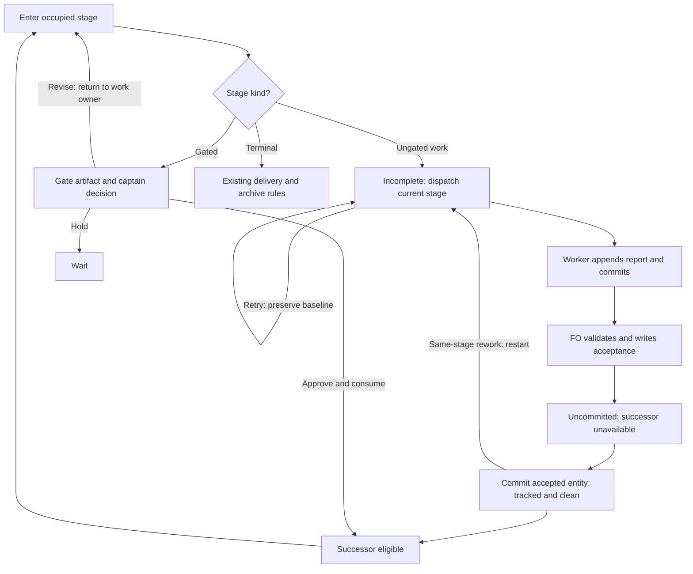

Design the smallest lifecycle change that makes stage occupancy distinct from completed stage work. The captain requested filing and ideation only; implementation requires a later design approval.

## Problem

A fresh email batch has status intake but no intake artifact. In intake -> triage -> done, the scheduler selects triage directly when intake is initial. Initial stages are exempt from completion proof. Non-initial ungated stages infer completion from committed reports. Gated work has a durable gate-attempt boundary. These meanings conflict.

The intended email flow is intake fetching a closed batch, triage classifying it and preparing human approval, then an execution hook reconciling approved changes before archive. Adding a queued stage hides the lifecycle inconsistency.

## Proposed direction for ideation

Prefer one ungated completion field, provisionally stage-complete: false|true. Status identifies the occupied stage. Initial selects the starting stage, not an exemption from work. An incomplete ungated stage dispatches itself. The FO validates the worker report and records completion through a guarded binary operation. Workers retain report ownership and never mutate lifecycle state.

Gate attempts remain authoritative for gated work. Do not add a competing gated completion flag or a new attempt registry. Determine the smallest representation and command surface; the field name and grammar are proposals, not approved implementation.

Actual entry or revision resets ungated completion atomically. Idempotent status stamps and dispatch retries must not reset completion. Specify how a new execution avoids accepting an old report. Decide absent-field semantics and migration explicitly so legacy backlog workflows do not suddenly execute their seed stages. Include initial gated seed behavior in that compatibility decision.

## Risk evidence

Current code: internal/status/entered_stage.go exempts initial, gated, and terminal stages from entered-stage completion checks. internal/status/format.go dispatchAnalysis projects the successor unless current-stage work is incomplete. internal/status/entered_stage_test.go explicitly tests initial-stage successor projection.

The email pilot observed missing intake artifacts with triage selected. Its no-op fixture covered approval-to-archive, not fresh-seed dispatch. Reproduce the initial-stage selection in a small isolated fixture before designing the change. Do not mutate live email workflows or call providers.

Relevant contracts: skills/first-officer/references/fo-dispatch-core.md, skills/commission/SKILL.md, docs/specs/gate-resolution-frontmatter-contract.md, and the state creation/mutation/dispatch implementations.

## Acceptance criteria

**AC-1 — Fresh batches execute intake before triage.**
Verified by: a fixture creates an incomplete intake seed and observes intake as the first dispatch target; triage becomes eligible only after validated intake completion. Restoring initial-stage successor projection must fail the check.

**AC-2 — Completion is durable and cannot leak across stage entry or revision.**
Verified by: fixture transitions exercise completion, restart, actual re-entry, and idempotent dispatch. A stale report or retained prior completion must not skip new work.

**AC-3 — Gated decision authority and legacy workflow behavior remain explicit.**
Verified by: fixtures cover gate approval/consume, ungated destinations, initial gated seeds, and the chosen absent-field migration rule. A duplicate completion authority or silent legacy seed dispatch must fail a check.

## Ideation deliverables

Recommend one minimal design, exact command and stored-field semantics, transition table, compatibility decision, affected contract wording, expected files/net LOC/tolerance, and a focused test plan. Name existing proof owners and the distinct failure each added test catches. Challenge whether the proposed field is necessary before expanding it. Stop at the ideation approval gate.

## Out of scope

Template-backed new command parameters, seed typo validation, email classification policy, generic external-proof registries, provider operations, and implementation during ideation.

## Ideation design

Recommend explicit completion for ungated work, with gradual entity migration. Keep `status` as occupancy and `stage-complete: false|true` as the sole ungated completion authority. Add one narrowly scoped freshness datum, `stage-report-baseline: N`, where N is the count of exact-current-stage report sections present at entry. This is a proposal for the ideation gate, not implementation authorization.

### Visual lifecycle for review



The gate path retains the existing terminal-target exception: approval routes through merge guard rather than ordinary consume. Initial gated seeds remain committed review artifacts. Absent-field legacy seeds retain their explicit compatibility rule below; the diagram shows the managed lifecycle. Entering/restarting ungated work captures the report baseline atomically; retries preserve it.

### Necessity and smallest alternatives

The narrow intake-skip bug could be fixed with an initial-stage scheduling change and an explicit compatibility rule; it does not by itself require durable FO acceptance. The selected product requirement is broader: the FO validates the worker's report and records an acceptance that survives restart before successor work can begin (AC-1/AC-2). For that requirement, a boolean distinguishes reported work from accepted work. If the captain instead wants only the narrow skip fix, drop the acceptance mechanism rather than justifying it with that bug.

A boolean alone is insufficient for AC-2: resetting true to false leaves the previous report in the body, and the existing validator would accept it again. The baseline is freshness evidence, not another completion flag. Count exact-stage report headings using the same selector grammar as completion validation; the latest report must have an ordinal greater than the entry baseline. This guarantee is conditional on the existing append-only canonical report protocol: preserve prior exact-stage report headings and append the new execution's report after them. Editing report prose or unrelated body text without changing report headings cannot satisfy the count check. Inserting a preceding matching heading, reordering history, or copying an old report into a new section can defeat a count-based freshness claim. The binary does not authenticate report history or prove semantic freshness; the FO must reject those history rewrites or copied evidence during report review. This task's AC-2 proof covers stale retained reports under that protocol, not arbitrary adversarial body rewrites. Existing ensigns already append reports on correction rounds, so no new worker identifier, integrity registry, or report format is needed. The FO still judges whether the newly appended evidence addresses the assignment; a copied report is not semantically sufficient merely because it is mechanically fresh.

Alternatives rejected: a synthetic queued stage hides the occupancy ambiguity; a timestamp relies on clocks and report timestamps that do not exist; scanning Git for dispatch commit messages makes message spelling, history depth, rebases, and unstamped paths part of lifecycle authority. A report digest plus entry identifier or an attempt registry adds more state than a baseline integer. The proposed baseline and restart operation serve AC-2 specifically, not an independent feature. There is no completion state for gated work.

### Stored fields and command grammar

- `stage-complete` accepts exactly `false` or `true`. The binary writes canonical scalar values; JSON field projection follows the existing string-valued status convention. Blank or malformed explicit values are invalid, not legacy.
- `stage-report-baseline` is a binary-owned nonnegative integer. Both keys occur together on an explicitly managed ungated nonterminal stage. Baseline without completion, completion without baseline in persisted state, or these keys on gated/terminal stages fail validation. `new` may accept seed input containing only `stage-complete: false` and generates the baseline atomically. Seed input `true` is refused.
- `spacedock status --workflow-dir DIR --set REF stage-complete=true` is the FO acceptance operation. It requires an ungated nonterminal current stage, a structurally complete latest exact-stage report, current entity bytes tracked and clean in local HEAD, and a report ordinal above the stored baseline. It changes only completion to true. Repeating it when already true is a byte-preserving success and grants no new authority. It never advances status, commits, or pushes; writing true makes the entity dirty. Both successor selection (`--next` and boot) and status advancement require true AND the current entity path tracked and clean against local HEAD, reusing `entityGitFailure`. While acceptance is dirty, emit no dispatch row, expose `next-suppressed-by=completion-uncommitted` when that computed field is requested, and refuse advancement byte-clean. Do not redispatch the accepted stage. The FO follows acceptance with the existing `spacedock state commit REF --workflow-dir DIR` boundary; only then is the successor eligible. Unrelated sibling dirt remains irrelevant. Any later uncommitted edit to the entity suppresses successor selection again until committed.
- There is no `--set REF stage-complete=false` operation. Refuse it with an instruction to use `--restart-stage REF`; false remains valid seed input to `new`. One restart operation owns pending legacy adoption and same-stage rework, avoiding two spellings for the same lifecycle effect.
- `spacedock status --workflow-dir DIR --restart-stage REF` adopts pending legacy work or explicitly starts another execution of the same ungated nonterminal stage. It requires a clean tracked entity and atomically writes false plus the current report count. It clears neither gate history nor worker reports. This is an intentional new execution, not a dispatch retry; do not invoke it automatically on worker/runtime retry. Repeating it with identical state and body is naturally a no-op. The FO owns its commit and subsequent dispatch.
- Direct writes to `stage-report-baseline`, clearing lifecycle keys, or mixing a completion/restart operation with `status=...` or other updates are refused byte-clean, including with `--force`. `--force` does not bypass completion/freshness or gate authority. Unsupported stage kinds and malformed state fail closed. Existing administrative overrides outside this lifecycle remain outside this task.
- Ordinary `status=DEST` and gate-consume paths share one destination-initialization helper. A real destination change writes status and destination completion fields in the same atomic entity replacement. An explicit source cannot advance through `status --set`, with or without a worktree, until true is stored and the entity path is tracked and clean against HEAD; an uncommitted true is insufficient. Gated exits retain their current decision/application guards. Repeated same-stage stamps and `dispatch build --stamp` preserve completion and baseline.
- New operations use the existing entity-resolution/root-selection behavior. They retain the existing mutation text style (`stage-complete: false -> true`); existing default table columns and dispatch row JSON keys stay unchanged. `--fields stage-complete,stage-report-baseline` exposes stored values. Restart reports the affected field changes; errors use the existing nonzero status mutation convention.

### Transition and authority table

| Event | Stored state | Result |
| --- | --- | --- |
| Explicit ungated seed or actual ungated entry | false; capture destination report count | Dispatch occupied stage; retained reports are insufficient |
| Worker appends and commits a complete report | preserve false and baseline | FO reviews evidence; report alone does not unlock successor |
| FO writes acceptance, then commits it | true; baseline retained | Before commit: unavailable. Tracked and clean after commit: successor eligible |
| Same-stage stamp or dispatch retry | preserve both fields | No new execution; dirt still blocks accepted successor work |
| Same-stage rework or pending legacy adoption | restart writes false and recaptures count | Newly appended report required under append-only protocol |
| Gate approve, revise, or hold | gate attempts remain sole authority | Consume approved entry once; revise routes to work owner; hold waits |
| Gated or terminal destination | remove ungated fields atomically | Existing gate/delivery rules; initial gated seed needs committed seed, not report |

Existing worktree, capacity, gate, terminal, and delivery suppression remains in force. Incomplete intake becomes its own eligible target; this does not bypass concurrency limits or create a second running worker. The FO keeps addressable-worker checks and existing dispatch ownership.

### Explicit legacy migration

Absence of both fields means legacy behavior on reads: initial ungated seeds keep successor projection; noninitial ungated stages keep committed-report inference; initial gated seeds keep committed-seed gate preparation. Do not mutate state during `--next`, boot, or validate. No schema-version field, bulk rewrite, or inferred migration from missing reports is introduced.

`new` preserves absent-field seeds as legacy so existing backlog templates and automation do not change behavior on upgrade. Commissioning must distinguish a seed-only backlog from executable intake: omit the fields for an explicitly retained legacy seed-only backlog; include `stage-complete: false` for a stage that owns initial work. This compatibility exception is documented as legacy, not presented as the new meaning of `initial`.

An existing initial legacy backlog can leave normally; the first actual ungated destination entry initializes false/baseline, migrating forward without executing backlog. An existing working legacy entity can be adopted as pending via `--restart-stage REF` (fresh appended report required), or explicitly accepted through `stage-complete=true` after the old committed report passes existing validation; that acceptance initializes baseline to one less than the current report count. This latter operation is deliberate adoption of legacy proof, not a new execution. A legacy initial stage without a report cannot use it to fabricate completion. To run a legacy intake seed now, use `--restart-stage REF`. The removed set-false spelling is not a migration path. Same-stage stamps never migrate an absent seed.

### Observed spike and reproducibility

On 2026-09-09, the assigned launcher reported `spacedock 0.28.0-pre2`, contract 3. Repository HEAD was `af70297ddae6ec64444849e8e3fcf57484bc16e1`. A temporary Git repository declared `intake (initial) -> triage (gate) -> done (terminal)`, worktree false and concurrency 2. The binary created a batch with `status: intake` and no report; the fixture committed it and called `status --next --json`. Creation, Git commit, and status all exited 0. Observed row: `{"id":"fresh-batch","slug":"fresh-batch","current":"intake","next":"triage","worktree":"no"}`. Expected after explicit opt-in: next is intake. No email workflow or provider was touched.

Reproduce with a source-built launcher (`go build -o /tmp/spacedock-intake-spike ./cmd/spacedock`) and a disposable directory. Create `README.md` with this frontmatter:

```yaml
commissioned-by: spacedock@1
entity-type: batch
id-style: slug
stages:
  defaults: {worktree: false, concurrency: 2}
  states:
    - {name: intake, initial: true}
    - {name: triage, gate: true}
    - {name: done, terminal: true}
```

Enclose that frontmatter in `---` delimiters. In the disposable directory run `git init`, pipe `---\ntitle: Fresh batch\nstatus: intake\n---\nNo intake artifact exists.\n` (actual newlines) to `/tmp/spacedock-intake-spike new fresh-batch --workflow-dir "$PWD"`, commit README and the created entity, then run `/tmp/spacedock-intake-spike status --workflow-dir "$PWD" --next --json`. Declare local fixture Git identity if needed. Implementation adds `stage-complete: false` to the seed and asserts intake first; retain the absent-field version as the compatibility control.

The existing deterministic owner also ran successfully: `go test ./internal/status -run 'TestEnteredStageLegacySuppressionControls/initial_stage_keeps_successor_projection' -count=1 -v`. It asserts legacy initial current=backlog,next=implementation through both next and boot, independently confirming the live fixture's interpretation. The proposed baseline/reset mechanism is not implemented or claimed as proven by this spike.

### Cycle-2 throwaway exercise: durability and bounded freshness

On 2026-09-09, a one-off Python exercise in a disposable Git repository ran the proposed count and eligibility predicates against actual committed/uncommitted entity bytes. All six assertions passed and the process exited 0. It did not invoke nonexistent acceptance/restart CLI commands, modify product code, or repeat the original intake-skip fixture. The original binary observation remains the AC-1 baseline above.

Fixture recipe: initialize temporary Git with a local fixture-only identity; create `task.md` containing `status: intake`, false, baseline 1, and one canonical complete intake report; commit that path. Count exact `## Stage Report: intake` headings in this controlled body, set `fresh = count > baseline`, and model successor eligibility as `complete && tracked && git diff --quiet HEAD -- task.md`. The tracking check is `git ls-files --error-unmatch -- task.md`. Append another canonical report, commit, write true, commit, then restart by writing false and recapturing count, and commit again. Finally prepend a matching report heading before the old reports as the negative control. Use actual newlines and the same canonical DONE/evidence/Summary report structure as the existing fixture; no provider artifact is fetched.

| Observed step | Report count / baseline | Fresh by count | Tracked and clean | Modeled successor eligible |
| --- | --- | --- | --- | --- |
| Entry with retained old report | 1 / 1 | false | true | false |
| Append complete report and commit | 2 / 1 | true | true | false |
| Write acceptance before committing | 2 / 1 | true | false | false |
| Commit acceptance | 2 / 1 | true | true | true |
| Restart; keep prior reports unchanged | 2 / 2 | false | true | false |
| Negative control: prepend matching heading | 3 / 2 | true | true | false (completion still false) |

The final row demonstrates a real limit: the count marks the unchanged old latest report fresh after a preceding-heading insertion; an acceptance based only on count could therefore accept it. This is why the recommendation explicitly relies on append-only report history and FO review rather than claiming arbitrary body-rewrite resistance. Under that bounded protocol, entry and restart rejected the retained old report, and an appended complete report was eligible for acceptance. Removing the clean-path predicate would make the uncommitted acceptance row eligible, the precise durability failure the design now forbids.

Evidence scope: Git tracking/diff/commit behavior was exercised directly. Counting and eligibility were a throwaway design model over simple canonical reports, not tests of the shipped parser, scheduler, acceptance setter, or restart command. The durable report fixture was syntactically complete by construction; this exercise did not test the product's structural validator. The implementation's existing `entered_stage_test.go` owner must still drive the real commands and assert these outcomes. No broad suite was rerun; prior broad-suite compile failures remain failures, not green validation.

### Proof plan and semantic boundaries

Write the focused failing fixture for each stage before implementation. Reuse current proof owners rather than adding a parallel harness:

| AC | Primary existing owner; proposed behavior check | Distinct falsifying change | Cost/type |
| --- | --- | --- | --- |
| AC-1 | `internal/status/entered_stage_test.go`: create explicit intake seed; compare next and boot before report, after committed report but before acceptance, and after acceptance; add intake-to-terminal case | Restore unconditional initial successor projection, or infer explicit completion directly from report | Small deterministic Git fixtures |
| AC-1 | `internal/status/native_new_from_root_test.go`: real new path writes false plus baseline, rejects true seed, preserves absent seed | Make new silently omit or default completion incorrectly | Small deterministic creation fixture |
| AC-2 | `internal/status/entered_stage_test.go` mutation cases: accept then assert no next/boot row and no away mutation before commit; commit/reload unlocks successor; same-stage stamp preserves true; entry/restart captures baseline; retained report, prose-only edits, dirty report and wrong-stage report refuse; appended valid report succeeds under append-only history; set-false refuses and restart adopts legacy work | Permit dirty acceptance, retain true across entry, reset on a stamp, omit count comparison, or allow removed setter | Medium table of existing local-Git fixtures; no sleeps/network |
| AC-2 | `internal/dispatch/build_stamp_test.go`: repeated stamped dispatch preserves completion/baseline and keeps the existing entry commit ownership | Dispatch stamps reset the lifecycle or create fresh acceptance authority | Small deterministic integration case |
| AC-3 | `internal/gates/application_test.go`: approval consume initializes ungated destination in the same write; repeated consume preserves destination progress; failed/stale consume preserves bytes | Split reset from consume, reset on repeat, or let completion bypass application | Medium existing gate fixtures |
| AC-3 | `internal/gates/prepare_initial_seed_test.go` plus existing initial suppression case: committed initial gated seed still prepares without report; absent ungated backlog still skips itself; malformed partial opt-in refuses | Require a gated seed report, silently run absent backlog, or treat malformed explicit fields as legacy | Small deterministic controls |
| AC-1/2/3 | `internal/ensigncycle/shared_keep_moving_durable_test.go` existing durable journey owner: add explicit intake journey and require acceptance commit between report and successor; feedback return requires fresh report | FO prose omits acceptance, stamps reset completion, or feedback consumes old report | Medium shared behavior fixture; retain its existing runtime lane, no provider calls |

The count proof is intentionally conditional on append-only report history. Do not add a fixture that claims a preceding-heading insertion is safely rejected by this design: the cycle-2 negative control demonstrates the opposite. The FO review owns compliance with that protocol; stronger history integrity would require a separately approved mechanism.

A small shared helper may hold field parsing, exact-stage report counting, and entry/reset calculation for status and gates; it must not import CLI or own dispatch, Git history, gate decisions, or a general proof registry. Move the existing report selector grammar into that helper rather than creating competing report matching. Full tests and race tests remain implementation checks; no fresh live host/auth experiment is needed because this task changes lifecycle state rather than runtime integration.

Approved semantic boundary sought: two optional stored scalars; one guarded existing `--set` field and one new `--restart-stage REF` action; explicit ungated current-stage scheduling and committed acceptance, including the requested-field suppression reason `completion-uncommitted`; atomic entry/reset through status and gate consumption; explicit absence compatibility; FO acceptance/restart instruction updates; commissioning examples and lifecycle/command/schema docs. Gated decision vocabulary, attempt identities, terminal approval consumption, delivery hooks, worker body ownership, runtime adapters, and provider behavior do not change. A gate writer's preservation contract gains only the named destination lifecycle-field exception.

### Expected surface and estimate

Estimate net LOC change: +630, across 25 files (approximately 800 insertions, 170 deletions). Tolerance: net +430 to +830 and 21 to 29 files. Cycle 2 removes the set-false adoption branch and adds the explicit scheduler durability guard; the net estimate is reduced by 20 lines and the scheduler file is named separately. This is the implementation baseline for gate approval, excluding this ideation-only entity body. Crossing the semantic boundary requires review even within the numeric tolerance.

Expected files: `internal/stagecompletion/stagecompletion.go` (new small shared helper); `internal/status/{entered_stage.go,entered_stage_test.go,format.go,gate_extract.go,handlers.go,status.go,new.go,native_new_from_root_test.go,validate.go}`; `internal/gates/{application.go,application_test.go,io.go,prepare_initial_seed_test.go}`; `internal/dispatch/build_stamp_test.go`; `internal/cli/{help.go,status_help_test.go}`; `internal/ensigncycle/shared_keep_moving_durable_test.go`; `skills/first-officer/references/fo-dispatch-core.md`; `skills/commission/SKILL.md`; `docs/schema/entity.mdschema.yml`; `docs/specs/gate-resolution-frontmatter-contract.md`; `docs/site/concepts/stage-lifecycle.md`; `docs/site/reference/command-reference.md`. The frontmatter reference page is an expected optional 26th file if its preservation summary needs the same explicit exception. No changes to runtime-specific ensign adapters are planned.

### Proposed contract and documentation wording

- `skills/first-officer/references/fo-dispatch-core.md`, dispatch selection: replace “If current is initial and next is terminal, set dispatch_stage = current” with “For explicit ungated lifecycle state, use the scheduler's next target, including current-stage intake. Retain the initial-to-terminal fallback only for absent-field legacy entities.”
- Same file, completion: replace “If not gated: terminal -> merge; else decide reuse-or-fresh” with “For ungated nonterminal work, validate the report, run status --set REF stage-complete=true, and commit that entity through state commit before successor selection. A report or worker completion message does not itself mark explicit stage work complete. A refused acceptance stops advancement. True that is not committed and path-clean produces no dispatch row and cannot advance; commit it before selecting the successor. Gates retain their existing gate lifecycle.”
- Same file, revision: add “Pending legacy adoption or a new execution in the same ungated stage uses status --restart-stage REF and a state commit before dispatch. Ordinary same-stage status stamps and worker dispatch retries preserve lifecycle state. Workers append their canonical report and never write completion fields.”
- `skills/commission/SKILL.md`, seed template guidance: add “Status names the stage the entity occupies. For an initial ungated stage that performs work, include stage-complete: false in seed input; new captures the report baseline. For an intentionally seed-only legacy backlog, omit completion fields and explain that compatibility choice. Initial gated seeds remain committed artifacts for gate review and carry no ungated completion fields.”
- `docs/site/concepts/stage-lifecycle.md`, after opening paragraph: add “Occupying an ungated stage does not mean its work is complete. Explicit stages dispatch themselves until the first officer accepts a fresh committed report, records stage-complete: true, and commits the entity. Until those accepted bytes are tracked and clean against HEAD, successor work is unavailable. Report-count freshness assumes the existing append-only report history; the first officer also reviews the evidence. Entering or restarting work resets completion; retrying dispatch does not. Initial chooses where work starts. Older entities with no completion fields retain their legacy seed behavior until explicitly adopted or advanced.”
- `docs/site/reference/command-reference.md`, status entry: add “--set REF stage-complete=true accepts a fresh committed ungated report; --restart-stage REF adopts pending legacy work or starts another execution of the current ungated stage. The false setter is refused; false remains seed input. Each operation is followed by state commit. Successor selection and advancement require the accepted entity to be tracked and clean against HEAD; uncommitted acceptance is suppressed as completion-uncommitted. Completion cannot be forced or applied to gates.” Update ungated-to-terminal example to show acceptance and commit before the existing finalization command; preserve the warning that terminal-target gate approvals are consumed only by merge guard.
- `docs/schema/entity.mdschema.yml`: add optional canonical `stage-complete` (boolean) and `stage-report-baseline` (nonnegative integer), pair/stage-kind validation, binary ownership, absence migration, append-only report-count scope, and the reset/committed-acceptance rules above. Stored scalars remain projectable through the existing status string representation.
- `docs/specs/gate-resolution-frontmatter-contract.md`: replace the consumed-successor sentence “After the worker report is durable, ordinary atomic terminal fields can complete that successor without --force” with “After fresh ungated work is accepted and stage-complete is committed, ordinary atomic terminal fields can complete that successor without --force. Consuming entry initializes false and its destination report baseline atomically. Repeated consume preserves the destination's work state.” Qualify preservation wording: “Status-changing gate writes may initialize or remove only stage-complete and stage-report-baseline with the destination status; other top-level fields and the Markdown body retain their existing preservation guarantee.”

## Stage Report: ideation

- DONE: Recommend the smallest consistent lifecycle design with exact field/command semantics, gate authority, reset behavior, and explicit legacy migration; challenge the proposed field before adding machinery.
  AC-1/AC-2/AC-3: Ideation design specifies one completion boolean and a justified report-count freshness baseline, guarded acceptance/restart, an authority table, and gradual absent-field migration; no attempt registry or runtime mechanism.
- DONE: Exercise the riskiest stage-selection path in an isolated fixture and record observed evidence plus behavioral proof plans for AC-1, AC-2, and AC-3, reusing existing proof owners.
  AC-1: new/commit/next fixture exited 0 and wrongly selected triage from reportless intake; existing initial projection test passed, and the proof table names reset, gate, legacy, dispatch, and durable-journey falsifiers for AC-2/AC-3.
- DONE: Commit the ideation design and canonical stage report with AC citations, expected files and net LOC with tolerance, semantic boundaries, and proposed contract/doc wording; stop before implementation.
  This path-scoped state artifact contains the design and report, +650 net LOC across 24 expected implementation files with explicit tolerance, and concrete wording for the affected contracts and docs; no implementation files were changed.

### Summary

Recommend explicit ungated completion plus a current-stage report baseline, preserving gate authority and legacy seeds while requiring executable intake to opt in. The isolated observed failure and existing proof-owner plan are recorded above; implementation awaits ideation approval. Required full and race test commands encountered unrelated compile errors in untracked `tmp/dispatch-027/stash-recovery-copy/untracked-files/archived_annotation_decode_test.go` (`decodeProviderResult` and `verifyProviderResolution` undefined); the focused status test passed, and required gofmt ran with its unrelated whitespace-only changes restored.

## Stage Report: ideation (cycle 2)

- DONE: Recommend the smallest consistent lifecycle design with exact field/command semantics, gate authority, reset behavior, and explicit legacy migration; challenge the proposed field before adding machinery.
  AC-1/AC-2/AC-3: Revised design separates the narrow skip fix from selected durable FO acceptance, requires tracked/clean acceptance for scheduling and advancement, removes set-false adoption, and retains restart plus gate authority and legacy rules.
- DONE: Exercise the riskiest stage-selection path in an isolated fixture and record observed evidence plus behavioral proof plans for AC-1, AC-2, and AC-3, reusing existing proof owners.
  AC-2: Six one-off assertions exercised real Git durability and modeled count freshness: stale at entry, fresh append, dirty acceptance blocked, committed acceptance eligible, stale after restart, and preceding-heading negative control; AC-1 original fixture retained and AC-1/AC-2/AC-3 owners updated.
- DONE: Commit the ideation design and canonical stage report with AC citations, expected files and net LOC with tolerance, semantic boundaries, and proposed contract/doc wording; stop before implementation.
  Revised state artifact includes the vertical Mermaid lifecycle, seven-row transition table, +630 net LOC across 25 expected implementation files (net +430 to +830; 21–29 files), synchronized wording, and explicit proof limitations; only this task body is committed.

### Summary

The three review corrections are addressed without implementation or a new authority: accepted work must be committed, report-count freshness is bounded to append-only history, and restart owns pending adoption/rework. The throwaway model exposes its preceding-heading weakness rather than claiming arbitrary rewrite protection; real command-level proof remains assigned to existing implementation test owners. No broad suites were rerun, and their earlier failures remain failures; this revision returns for independent review and a visual ideation decision.
